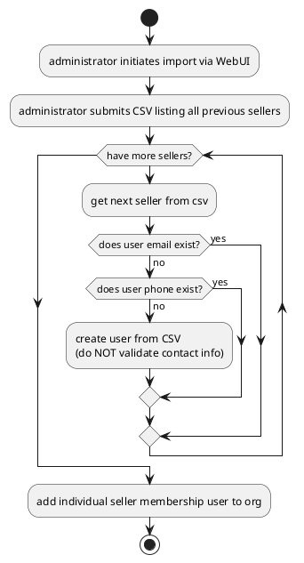
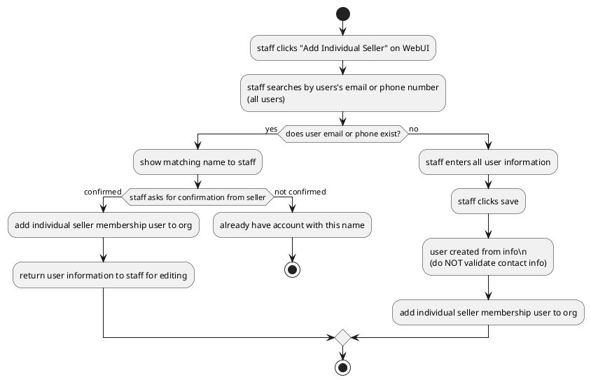
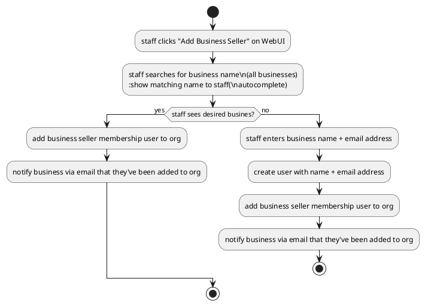
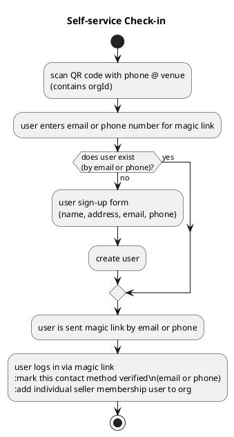
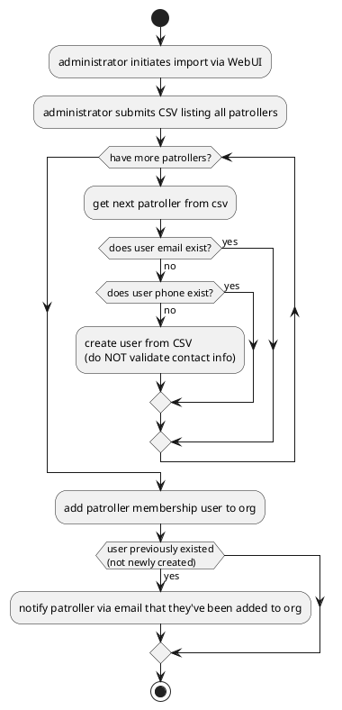

# Ski Swap
## Previous Individual Seller Import Process

## Staff Adds Individual Seller

## Staff Adds Business Seller

## Self-service Check-in

# Patroller / Roster
## Patroller Import Process
