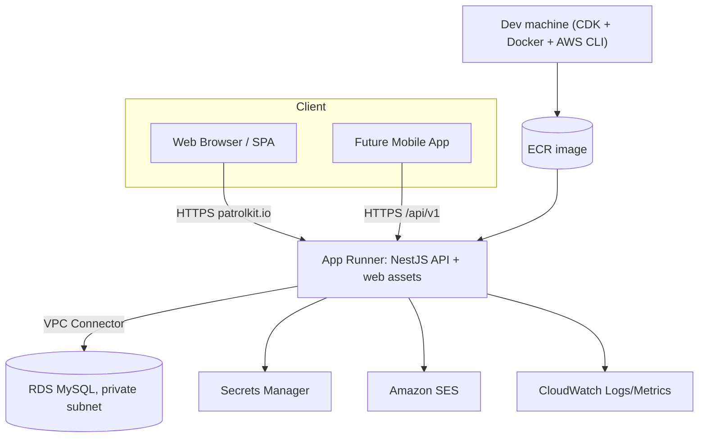

# PatrolKit — Implementation Plan (Fresh Rebuild)

> **Status:** Draft v1 — living document. This plan is written to be consumed by an
> implementing LLM. It is intentionally prescriptive about structure, contracts, and
> sequencing, while leaving business-module features out of scope (foundation only).

---

## 1. Overview & Goals

PatrolKit is being rewritten from scratch. This effort delivers the **foundation only**:
multi-organization support, authentication, user management, a permission system, a
pluggable "module" framework (modules themselves are **not** built yet), and independent
device provisioning for a future mobile app.

### In scope (this plan)
- Organizations + membership (a user belongs to 1..N orgs and can switch between them).
- User authentication via **magic link only** (no passwords).
- **Device** authentication for the future mobile app — provisioned per-org, independent of any user.
- **Granular, DB-backed permissions** mapped per user, per organization. ("Roles" = future grouping.)
- **Bulk user import** by a user holding the `users:import` permission (the "user_admin" capability).
- **Module framework**: orgs can have functionality modules enabled/disabled. The minimum
  capability for every org is user management. No concrete feature modules are built yet.
- Web frontend: **reuse the existing landing page and color system**, rebuilt on a fresh stack.
- AWS deployment with Infrastructure-as-Code.

### Explicitly out of scope (do NOT build)
- Any previous PatrolKit feature module (scheduling, incidents, training, equipment, communications).
- The mobile app itself (only the API contract that supports it).
- Passwords / password login.

### Non-functional targets
- **Audience:** small — at most a few hundred concurrent users. Optimize for **low cost and
  operational simplicity**, not extreme scale.
- Secure by default (OWASP Top 10 conscious), observable, reproducible environments.

---

## 2. Technology Decisions (with rationale)

| Area | Choice | Rationale |
|---|---|---|
| API language/framework | **NestJS + TypeScript** | Native module system mirrors the "org modules" concept; guards/decorators are ideal for per-request permission enforcement; strong DI and testability; excellent for LLM code generation. |
| ORM | **Prisma** | First-class MySQL support, type-safe client, easy migrations + seeding. |
| Validation / shared types | **Zod** via `nestjs-zod` | Single source of truth for request/response schemas. Schemas + inferred types live in the API's `contracts/` folder and are imported by the web app via a path alias (no separate package). |
| Database | **RDS MySQL 8.x** (single-AZ) | Requested SQL engine; a single instance keeps cost and complexity low for this audience. |
| API hosting | **AWS App Runner** (container) | Simplest managed container hosting: built-in HTTPS, autoscaling, deploys from ECR. Lowest ops burden for hundreds of users. **Alternative:** ECS Fargate if finer control/networking is later required. |
| Web frontend | **React + Vite + TypeScript + Tailwind CSS** | Matches the reusable landing page/branding; static build; fast DX. |
| Web hosting | **Served by the API** (App Runner) | The React build + landing page are served as static assets by the NestJS app at the same origin as `/api/v1` — one deploy, no CORS, no CDN. |
| Email (magic links) | **Amazon SES** | Native AWS, cheap, already used previously. Local dev uses **Mailpit**. |
| Secrets | **AWS Secrets Manager** | DB creds + JWT signing keys, rotatable. |
| IaC | **AWS CDK (TypeScript)** | Same language as the rest of the repo; App Runner + RDS + networking in code. |
| Repo tooling | **pnpm workspace** (no Turborepo) | Two apps (`api`, `web`) in one workspace; kept intentionally minimal for a solo dev. |
| Deployment | **Manual from dev machine** (CDK + Docker + AWS CLI scripts) | Solo dev, small audience — no CI infrastructure to maintain. GitLab CI/CD can be layered on later without app changes. |
| Auth tokens | **JWT (EdDSA / Ed25519)** signed with keys in Secrets Manager | Asymmetric signing supports rotation and future service verification; short-lived access tokens. |

> **JWT signing:** **EdDSA (Ed25519)** — current best practice (compact, fast, no padding-oracle
> class of issues that dog RSA). Keys are generated per environment and stored in Secrets Manager.

---

## 3. Repository Layout

Everything lives under the `server/` workspace directory.

```
server/
├─ package.json                 # workspace root scripts
├─ pnpm-workspace.yaml
├─ tsconfig.base.json
├─ .env.example
├─ docker/
│  └─ docker-compose.yml        # local MySQL + Mailpit
├─ apps/
│  ├─ api/                      # NestJS REST API (also serves the built web app)
│  │  ├─ prisma/
│  │  │  ├─ schema.prisma
│  │  │  ├─ seed.ts
│  │  │  └─ migrations/
│  │  └─ src/
│  │     ├─ main.ts
│  │     ├─ app.module.ts
│  │     ├─ common/             # guards, interceptors, filters, decorators
│  │     ├─ auth/               # magic link, refresh, device token
│  │     ├─ users/
│  │     ├─ orgs/
│  │     ├─ memberships/
│  │     ├─ permissions/
│  │     ├─ modules/            # org-module framework (enable/disable)
│  │     ├─ devices/
│  │     ├─ platform/           # super-admin endpoints
│  │     ├─ contracts/          # zod schemas + inferred types (imported by web)
│  │     └─ mail/               # SES + local transport
│  └─ web/                      # React + Vite SPA (built output served by the API)
│     ├─ public/landing.html    # reused from previous build
│     └─ src/...
└─ infra/                       # AWS CDK app (TypeScript)
```

---

## 4. Data Model

Prisma schema (MySQL). Security notes: **store only hashes** of magic-link tokens, refresh
tokens, and device secrets — never raw values.

```prisma
datasource db {
  provider = "mysql"
  url      = env("DATABASE_URL")
}

generator client {
  provider = "prisma-client-js"
}

model User {
  id            String   @id @default(cuid())
  email         String   @unique
  name          String
  status        String   @default("active") // active | disabled
  isSuperAdmin  Boolean  @default(false)     // platform-wide administrator
  createdAt     DateTime @default(now())
  updatedAt     DateTime @updatedAt

  memberships   Membership[]
  magicLinks    MagicLink[]
  refreshTokens RefreshToken[]
}

model Organization {
  id        String   @id @default(cuid())
  name      String
  slug      String   @unique
  status    String   @default("active") // active | suspended
  createdAt DateTime @default(now())
  updatedAt DateTime @updatedAt

  memberships Membership[]
  orgModules  OrgModule[]
  devices     Device[]
}

model Membership {
  id        String   @id @default(cuid())
  userId    String
  orgId     String
  status    String   @default("active")
  joinedAt  DateTime @default(now())

  user        User                   @relation(fields: [userId], references: [id], onDelete: Cascade)
  org         Organization           @relation(fields: [orgId], references: [id], onDelete: Cascade)
  permissions MembershipPermission[]

  @@unique([userId, orgId])
}

model Permission {
  id          String   @id @default(cuid())
  key         String   @unique      // e.g. "users:import"
  description String
  createdAt   DateTime @default(now())

  memberships MembershipPermission[]
  devices     DevicePermission[]
}

model MembershipPermission {
  membershipId String
  permissionId String
  grantedAt    DateTime @default(now())

  membership Membership @relation(fields: [membershipId], references: [id], onDelete: Cascade)
  permission Permission @relation(fields: [permissionId], references: [id], onDelete: Cascade)

  @@id([membershipId, permissionId])
}

model ModuleCatalog {
  key         String   @id            // e.g. "user_management"
  name        String
  description String
  isCore      Boolean  @default(false) // core modules cannot be disabled (e.g. user management)

  orgModules  OrgModule[]
}

model OrgModule {
  id         String    @id @default(cuid())
  orgId      String
  moduleKey  String
  enabled    Boolean   @default(false)
  enabledAt  DateTime?
  enabledBy  String?
  updatedAt  DateTime  @updatedAt

  org    Organization  @relation(fields: [orgId], references: [id], onDelete: Cascade)
  module ModuleCatalog @relation(fields: [moduleKey], references: [key])

  @@unique([orgId, moduleKey])
}

model MagicLink {
  id        String    @id @default(cuid())
  userId    String
  tokenHash String    @unique         // SHA-256 of the raw token
  expiresAt DateTime
  usedAt    DateTime?
  createdAt DateTime  @default(now())

  user User @relation(fields: [userId], references: [id], onDelete: Cascade)
}

model RefreshToken {
  id         String    @id @default(cuid())
  userId     String
  tokenHash  String    @unique
  expiresAt  DateTime
  revokedAt  DateTime?
  userAgent  String?
  ipAddress  String?
  createdAt  DateTime  @default(now())

  user User @relation(fields: [userId], references: [id], onDelete: Cascade)
}

model Device {
  id          String    @id @default(cuid())
  orgId       String
  name        String
  clientId    String    @unique
  secretHash  String                    // Argon2/bcrypt hash of the client secret
  status      String    @default("active") // active | revoked
  lastSeenAt  DateTime?
  createdBy   String?
  createdAt   DateTime  @default(now())
  revokedAt   DateTime?

  org         Organization       @relation(fields: [orgId], references: [id], onDelete: Cascade)
  permissions DevicePermission[]
}

model DevicePermission {
  deviceId     String
  permissionId String

  device     Device     @relation(fields: [deviceId], references: [id], onDelete: Cascade)
  permission Permission @relation(fields: [permissionId], references: [id], onDelete: Cascade)

  @@id([deviceId, permissionId])
}

model AuditLog {
  id         String   @id @default(cuid())
  actorType  String   // user | device | system
  actorId    String?
  orgId      String?
  action     String   // e.g. "device.provisioned"
  targetType String?
  targetId   String?
  metadata   Json?
  ipAddress  String?
  createdAt  DateTime @default(now())

  @@index([orgId, createdAt])
}
```

---

## 5. Authentication & Authorization Design

### 5.1 User authentication — magic link only

1. `POST /auth/magic-link` `{ email }` → **always returns 200** (do not reveal account
   existence). If the user exists and is active: create a `MagicLink` (store SHA-256 of a
   32-byte random token, 15-minute expiry) and email the raw token as a link to the web app.
2. User opens the link → web calls `POST /auth/magic-link/verify` `{ token }`. Server verifies
   the hash, checks not-used and not-expired, marks it used, then:
   - Issues a short-lived **access token** (JWT, ~15 min, `sub = userId`).
   - Issues a **refresh token**, stores its hash, and sets it as an **httpOnly, Secure,
     SameSite=Strict cookie** (the web app is same-origin). Access token is returned in the JSON
     body (kept in memory by the SPA).
3. **New users** created via bulk import use the **same magic-link flow** for first login —
   no separate invite/password step.

### 5.2 Token lifecycle
- **Access token:** JWT, ~15 min, `sub = userId`, no org claim (see org switching).
- **Refresh token:** opaque random value, hash stored in `RefreshToken`, ~30 day expiry,
  **rotated** on each `POST /auth/refresh` (old one revoked). Delivered via httpOnly cookie.
- `POST /auth/logout` revokes the current refresh token and clears the cookie.

### 5.3 Organization context & switching
- The access token is **user-scoped only** — it contains no org.
- All org-scoped endpoints are namespaced under `/orgs/:orgId/...`.
- An `OrgContextGuard` loads the caller's `Membership` for `:orgId`; if none/inactive → 403.
- A `PermissionsGuard` + `@RequirePermissions('users:import')` decorator checks the resolved
  per-membership permission set.
- **Switching orgs = calling a different `:orgId`.** No token reissue required.
- `GET /me` returns the user plus all memberships (org + granted permission keys) so the SPA
  can render the org switcher and gate UI.

### 5.4 Device authentication — future mobile app
Devices are provisioned **per organization**, not tied to a user, using an OAuth2
**client-credentials** pattern:

1. A user with `devices:provision` calls `POST /orgs/:orgId/devices` `{ name, permissions[] }`.
   The API returns `clientId` + `clientSecret` **exactly once** (secret is only hashed at rest).
2. The device calls `POST /auth/device/token` `{ clientId, clientSecret }` and receives a
   short-lived access token (JWT, ~1 hour, claims: `deviceId`, `orgId`, `permissions`).
3. When the token expires the device re-requests one with its stored secret.
4. **Revocation:** `DELETE /orgs/:orgId/devices/:id` sets status `revoked`; the token endpoint
   then refuses. Already-issued short-lived tokens expire naturally (acceptable window). A
   `POST /orgs/:orgId/devices/:id/rotate-secret` supports secret rotation.

#### Extended-offline behavior (days–weeks)
- The **client secret never expires** — it is the device's durable, long-lived credential. A
  device that has been offline for days or weeks does **not** re-provision or "re-log in" in any
  human sense: on reconnect it simply calls `POST /auth/device/token` with its stored secret and
  receives a fresh access token in a single automatic round trip.
- The device SDK/app should **cache** its current access token and lazily refresh it (request a
  new one only when the cached token is expired or ~1–min from expiry). This keeps it fully
  functional across long offline gaps with no manual intervention.
- Provisioning is a **one-time** action; secrets only change if an admin explicitly rotates or
  revokes them. Revocation is therefore the single event that forces a device to be re-provisioned.

### 5.5 Permission enforcement
- Permissions are **DB rows** (`Permission`) mapped to memberships (`MembershipPermission`) and
  devices (`DevicePermission`).
- Guards resolve the effective permission set per request from the DB (cached briefly).
- `isSuperAdmin` users bypass org permission checks for platform/admin endpoints only; org data
  access still flows through the org-scoped endpoints for auditability.
- **Future "roles"** = named bundles of permission keys applied to a membership; the data model
  above does not need to change to add them later.

---

## 6. Initial Permission Catalog

Seed these permission keys. `users:import` is the "user_admin" capability referenced in the
requirements.

| Key | Description |
|---|---|
| `org:read` | View organization details. |
| `org:manage` | Edit organization settings. |
| `modules:manage` | Enable/disable org modules. |
| `users:read` | View members of the org. |
| `users:invite` | Invite a single user (sends magic-link onboarding). |
| `users:import` | **Bulk import** users (the "user_admin" capability). |
| `users:manage` | Edit/disable members. |
| `permissions:assign` | Grant/revoke permissions on a membership. |
| `devices:read` | View provisioned devices. |
| `devices:provision` | Create/provision devices + rotate secrets. |
| `devices:revoke` | Revoke devices. |

> A newly created org gets one **owner** membership seeded with all of the above.
> `user_management` is a **core** module and is always enabled.

---

## 7. API Surface (v1)

Base path: `/api/v1`. Standard envelope: success → `{ "success": true, "data": ... }`;
error → `{ "success": false, "error": "message", "code": "OPTIONAL_CODE" }`.

### Auth
| Method | Path | Auth | Notes |
|---|---|---|---|
| POST | `/auth/magic-link` | none | Request a magic link. Always 200. |
| POST | `/auth/magic-link/verify` | none | Verify token → access token + refresh cookie. |
| POST | `/auth/refresh` | refresh cookie | Rotate refresh, return new access token. |
| POST | `/auth/logout` | refresh cookie | Revoke refresh token. |
| POST | `/auth/device/token` | client creds | Device client-credentials → device access token. |

### Me
| Method | Path | Auth | Notes |
|---|---|---|---|
| GET | `/me` | user | User + memberships (orgs + permission keys). |
| PATCH | `/me` | user | Update own `name`. |

### Platform (super admin only)
| Method | Path | Notes |
|---|---|---|
| GET | `/admin/organizations` | List all orgs. |
| POST | `/admin/organizations` | Create org (+ seed owner membership + core module). |
| GET | `/admin/organizations/:id` | Org detail. |
| PATCH | `/admin/organizations/:id` | Update org. |
| DELETE | `/admin/organizations/:id` | Delete/suspend org. |

### Org-scoped (`/orgs/:orgId`)
| Method | Path | Permission | Notes |
|---|---|---|---|
| GET | `/orgs/:orgId` | `org:read` | Org details + enabled modules. |
| PATCH | `/orgs/:orgId` | `org:manage` | Update org settings. |
| GET | `/orgs/:orgId/members` | `users:read` | List members + permissions. |
| POST | `/orgs/:orgId/members` | `users:invite` | Invite single user (creates user if needed, sends magic link). |
| POST | `/orgs/:orgId/members/import` | `users:import` | **Bulk import** via CSV upload. |
| PATCH | `/orgs/:orgId/members/:userId` | `users:manage` / `permissions:assign` | Update status / permissions. |
| DELETE | `/orgs/:orgId/members/:userId` | `users:manage` | Remove membership. |
| GET | `/orgs/:orgId/permissions` | `users:read` | List assignable permission keys. |
| GET | `/orgs/:orgId/modules` | `org:read` | List modules + enabled state. |
| PATCH | `/orgs/:orgId/modules/:key` | `modules:manage` | Enable/disable a module (core cannot be disabled). |
| GET | `/orgs/:orgId/devices` | `devices:read` | List devices. |
| POST | `/orgs/:orgId/devices` | `devices:provision` | Provision device → returns clientId + secret once. |
| POST | `/orgs/:orgId/devices/:id/rotate-secret` | `devices:provision` | Rotate secret (returns new secret once). |
| DELETE | `/orgs/:orgId/devices/:id` | `devices:revoke` | Revoke device. |

### Bulk import CSV contract
- `Content-Type: multipart/form-data`, one file field `file`.
- Columns: `email` (required), `name` (required), `permissions` (optional; `;`-separated
  permission keys).
- **Max 500 rows per import** (expected typical size 300–400). Processing is **synchronous**
  within the request — no background job/queue needed at this scale. Reject larger files with a
  clear 413/422 error.
- **Onboarding emails are NOT sent by default.** Imported users are created/added silently and
  can sign in later via the normal magic-link flow. A `sendInvites` form field (`boolean`,
  default `false`) opts in to sending a magic-link onboarding email to each newly created/added
  user.
- Response reports per-row outcome: `created`, `already_member`, `invited` (only when
  `sendInvites=true`), or `error` (with reason).

---

## 8. Module Framework

- `ModuleCatalog` is the registry of available modules. Seed a single core entry:
  `user_management` (`isCore = true`).
- Each org gets `OrgModule` rows; core modules are force-enabled and cannot be disabled.
- A `ModuleEnabledGuard` + `@RequireModule('some_module')` decorator will gate future module
  routes. Foundation ships the guard and the catalog; **no concrete feature modules are built**.
- Future modules register by (a) adding a `ModuleCatalog` seed row and (b) mounting a NestJS
  feature module whose routes are protected by `@RequireModule(...)` and `@RequirePermissions(...)`.

---

## 9. Frontend Plan

- **Reuse** the existing landing page (`patrolkit/web/public/landing.html`) and its color system
  (dark `surface` palette `#1a1a1a`, red `brand` ramp `#dc2626`, Inter + Plus Jakarta Sans).
  Port it into `apps/web/public/landing.html` and align Tailwind config to the same tokens.
- **Stack:** React + Vite + TypeScript + Tailwind + TanStack Query + React Router. Import
  request/response types directly from the API's `contracts/` folder via a path alias — no
  separate shared package.
- **Serving:** the production Vite build (and the landing page) are served as static assets by
  the NestJS app at the **same origin** as `/api/v1`, so there is **no CORS** and refresh cookies
  are first-party. In dev, Vite runs its own server and proxies `/api` to Nest.
- **Screens (foundation):**
  - Magic-link request + verify (callback route).
  - App shell with **org switcher** (from `GET /me`).
  - Members list + single invite + **bulk CSV import** + permission assignment (permission-gated UI).
  - Module management (enable/disable toggles).
  - Device management (provision, show-secret-once modal, rotate, revoke).
  - Platform admin org list/create (super admin only).
- **Token handling:** access token in memory; refresh via httpOnly cookie; silent refresh on 401.

---

## 10. AWS Architecture

**Region:** `us-east-2` (Ohio). **Single origin:** `https://patrolkit.io` serves both the web
app/landing page and the API (`/api/v1`). `https://www.patrolkit.io` redirects to the apex.



- **Networking:** VPC with public + private subnets. RDS in **private** subnets (no public
  access), **single-AZ** (Multi-AZ intentionally omitted to keep cost/complexity low). App
  Runner reaches RDS via a **VPC connector**.
- **Secrets:** DB credentials + JWT signing keys in Secrets Manager; injected as env at runtime.
- **TLS/DNS:** Route53 hosted zone for `patrolkit.io`; App Runner-managed certificate for the
  custom domain. App Runner serves **both** the web app and the API at the apex `patrolkit.io`.
  `www.patrolkit.io` **redirects to the apex** (canonical URL).
- **Email:** SES in `us-east-2` (production access + verified `patrolkit.io` domain with DKIM
  required). Magic-link emails send from an address on `patrolkit.io`.
- **Cost note:** App Runner keeps ≥1 warm instance (no scale-to-zero). See Appendix A for the
  full cost breakdown and the alternatives considered.

### IaC (AWS CDK, TypeScript) — stacks
1. `NetworkStack` — VPC, subnets, security groups, VPC connector.
2. `DataStack` — RDS MySQL, Secrets Manager entries.
3. `ApiStack` — ECR repo, App Runner service (serves web + API), custom domain, Route53
   records, env wiring, IAM roles.
4. `SharedStack` — SES identity/config, CloudWatch alarms.

---

## 11. Configuration, Environments & Secrets

- Environments: `local`, `staging`, `production`.
- `.env.example` documents all variables. No secrets committed.

| Variable | Purpose |
|---|---|
| `DATABASE_URL` | Prisma MySQL connection string. |
| `JWT_PRIVATE_KEY` / `JWT_PUBLIC_KEY` | EdDSA signing keys (Secrets Manager in AWS). |
| `ACCESS_TOKEN_TTL` / `REFRESH_TOKEN_TTL` / `DEVICE_TOKEN_TTL` | Token lifetimes. |
| `MAGIC_LINK_TTL` | Magic-link expiry (default 15m). |
| `APP_URL` | Public web URL, e.g. `https://patrolkit.io` (used in magic-link emails). |
| `API_URL` | Public base URL, e.g. `https://patrolkit.io` (web + `/api/v1` share this origin). |
| `AWS_REGION` / `SES_REGION` | AWS region — `us-east-2`. |
| `EMAIL_FROM` | Magic-link sender, e.g. `noreply@patrolkit.io`. |
| `MAIL_TRANSPORT` | `ses` (prod) or `smtp` (local Mailpit). |
| `COOKIE_DOMAIN` | Cookie domain (`patrolkit.io`). CORS is not needed for the web app (same origin); the mobile client is not a browser. |
| `SEED_SUPERADMIN_EMAIL` | Bootstrap super-admin email seeded on first run (see §16). |

---

## 12. Security Considerations

- Store **hashes only** for magic-link tokens (SHA-256), refresh tokens (SHA-256), and device
  secrets (Argon2id or bcrypt).
- Magic-link + refresh endpoints: **rate limiting** (per IP + per email) to deter abuse/enumeration.
- Uniform 200 on magic-link request (no account enumeration).
- httpOnly + Secure + SameSite cookies for refresh tokens; access tokens never persisted to
  localStorage.
- Same-origin web app ⇒ **CORS not required** for the browser; Helmet-equivalent security
  headers; body size limits on CSV upload.
- Input validation on every endpoint via Zod DTOs.
- Per-org data isolation enforced centrally by `OrgContextGuard` (all queries scoped by `orgId`).
- `AuditLog` for sensitive actions (device provisioning/revocation, permission changes, imports).
- Least-privilege IAM roles for App Runner (SES send, Secrets read, CloudWatch only).

---

## 13. Observability

- Structured JSON logging (pino) with request IDs; ship to CloudWatch.
- Health endpoints: `GET /healthz` (liveness), `GET /readyz` (DB check).
- CloudWatch alarms: API 5xx rate, RDS CPU/connections, App Runner health.

---

## 14. Testing Strategy

- **Unit:** Vitest/Jest for services and guards.
- **Integration:** e2e tests against a disposable MySQL (Testcontainers) covering auth flows,
  permission enforcement, org isolation, device provisioning, bulk import.
- **Contract:** the Zod contracts validate request/response shape in tests.
- **Web:** component tests + optional Playwright smoke for the magic-link + member flows.
- Coverage gate on `auth`, `permissions`, `orgs`, `devices`.

---

## 15. Deployment (manual, from the dev machine)

CI/CD is **optional** at this scale. For a solo developer and a small audience, deploying
directly from the dev machine is reasonable. The repo ships deploy scripts (pnpm/Make
targets) so each step is a single command.

**One-time prerequisites:**
- AWS credentials on the dev machine via **IAM Identity Center (SSO)** profile (preferred) or an IAM
  deploy user (`aws sso login` / named profile).
- `cdk bootstrap` the `us-east-2` account/region once.
- Docker Desktop for building the API image.

**Provision / update infrastructure (occasional):**
- `pnpm infra:deploy` → `cdk deploy` all stacks (Network, Data, Api, Shared).

**Deploy the app (API + web in one image):**
1. `pnpm build` — build the web app (`vite build`) and the API; the web `dist/` is copied into
   the API image and served by NestJS.
2. `pnpm image:build` — `docker build` the combined image.
3. `pnpm image:push` — `aws ecr get-login-password | docker login`, tag with the git SHA, push to ECR.
4. `pnpm release` — `aws apprunner start-deployment` to roll the new image.

**Database migrations & bootstrap (no dev-machine→DB access required):**
- RDS lives in a **private subnet**, so the dev machine can't reach it directly. Instead, the API
  container runs `prisma migrate deploy` **on startup** (entrypoint) before serving traffic.
- The **super-admin seed is idempotent and also runs at startup**, driven by
  `SEED_SUPERADMIN_EMAIL` (see §16). The first deploy therefore self-bootstraps the schema and
  the initial super admin with no manual DB connection.
- At **min 1 instance** this is safe; if the service later scales out, gate migrations behind a
  single release step to avoid concurrent `migrate deploy` runs.
- For occasional direct DB access (debugging), use **SSM Session Manager port-forwarding**
  through a small bastion rather than exposing RDS publicly.

**Tradeoffs to accept (vs. a CI pipeline):**
- No automated test gate before deploy — run `pnpm test` locally first (wire it into the
  pre-deploy script so it's not skipped).
- No shared deploy audit trail; deploys depend on the dev machine + local AWS credentials.
- The developer is the pipeline (bus factor of one). Acceptable now; **GitLab CI/CD can be added
  later** (build/push to ECR + App Runner release) with no application changes.

---

## 16. Local Development

- `docker/docker-compose.yml` runs **MySQL 8** + **Mailpit** (captures magic-link emails).
- `pnpm install`, `pnpm db:migrate`, `pnpm db:seed`, `pnpm dev` (runs the Nest API + the Vite
  dev server, which proxies `/api` to Nest).
- Seed creates: one super-admin user, one demo org, one owner membership with all permissions,
  and the `user_management` core module enabled.
- Magic links in local dev are viewable in Mailpit's web UI.

### Super-admin bootstrap (all environments)
- The **first super admin is created by the seed step from an environment variable**
  (`SEED_SUPERADMIN_EMAIL`). The seed is **idempotent**: if a user with that email exists it is
  promoted to `isSuperAdmin`; otherwise it is created. No password is set — the super admin logs
  in via the normal magic-link flow.
- In production this runs as a one-off release step alongside `prisma migrate deploy`
  (e.g. `pnpm --filter api db:seed`), driven entirely by `SEED_SUPERADMIN_EMAIL`.

---

## 17. Phased Implementation Roadmap (for the executing LLM)

Each phase should be independently buildable, tested, and committed.

- **Phase 0 — Scaffolding:** pnpm workspace, tsconfig base, ESLint/Prettier, `apps/api`
  (NestJS), `apps/web` (Vite), `docker-compose` (MySQL + Mailpit). No Turborepo/shared package.
- **Phase 1 — Data layer:** Prisma schema (Section 4), initial migration, seed script,
  permission + module catalog seeds.
- **Phase 2 — Auth core:** JWT signing (EdDSA), magic-link request/verify, refresh rotation,
  logout, `mail` module (SES + SMTP transports), rate limiting.
- **Phase 3 — Orgs, membership, permissions:** `OrgContextGuard`, `PermissionsGuard`,
  `@RequirePermissions`, `GET/PATCH /me`, org switching, `GET /orgs/:orgId`.
- **Phase 4 — User management:** members list, single invite, **bulk CSV import**, permission
  assignment, platform super-admin org CRUD.
- **Phase 5 — Module framework:** `ModuleCatalog`, `OrgModule`, `@RequireModule`,
  enable/disable endpoints (core module protection).
- **Phase 6 — Devices:** provision (secret-once), device token endpoint (client-credentials),
  rotate, revoke, `AuditLog` wiring.
- **Phase 7 — Frontend:** port landing page + tokens, auth flow, app shell + org switcher,
  member management + import UI, module toggles, device management, super-admin org UI. Wire the
  Vite build to be served by the API (same origin); dev uses the Vite proxy.
- **Phase 8 — Infrastructure & deploy:** CDK stacks (Network, Data, Api, Shared), deploy scripts
  (combined web+API image build/push to ECR, App Runner release), container entrypoint that runs
  `prisma migrate deploy` + idempotent super-admin seed, first deploy to staging from the dev
  machine.
- **Phase 9 — Hardening:** audit coverage, security headers, alarms, integration test coverage
  gates, production deploy runbook.

---

## 18. Open Questions / Decisions to Confirm

### Resolved
- ✅ **Domains:** single origin `patrolkit.io` serves web + API (`/api/v1`); `www` → apex redirect.
- ✅ **Web delivery:** the API serves the React build + landing page — no S3/CloudFront, no CORS.
- ✅ **Repo tooling:** minimal pnpm workspace (no Turborepo, no shared package).
- ✅ **Region:** `us-east-2` (Ohio).
- ✅ **Device offline:** devices may be offline days–weeks; the client secret is permanent and
  never requires re-provisioning/re-login (see §5.4).
- ✅ **Super-admin bootstrap:** env-seeded via `SEED_SUPERADMIN_EMAIL` (see §16).
- ✅ **Compute:** App Runner (~$40–45/mo) — see Appendix A.
- ✅ **JWT algorithm:** EdDSA (Ed25519), best-practice default.
- ✅ **RDS:** single-AZ (no Multi-AZ) to keep it simple/cheap.
- ✅ **Bulk import:** max 500 rows, processed synchronously (see §7).
- ✅ **Landing page:** reuse as-is (no restyle during the port).

### Still open
- None — all decisions confirmed. Ready to break the roadmap into implementation-ready tasks.

---

---

## Appendix A — AWS Monthly Cost Estimates

Assumptions: region `us-east-2`, ~hundreds of users, low steady traffic, single-AZ unless
noted. Figures exclude taxes, free-tier credits, and atypical data-transfer spikes.

### Shared baseline (all compute options)

| Component | Config | Est. $/mo |
|---|---|---|
| RDS MySQL | `db.t4g.micro`, 20 GB gp3, single-AZ | ~$14 |
| Route 53 | 1 hosted zone (`patrolkit.io`) | ~$0.50 |
| Secrets Manager | ~3 secrets | ~$1.20 |
| SES | low-volume magic links | <$1 |
| ACM / App Runner TLS | certs | $0 |
| **Subtotal** | | **~$17** |

> Web assets are served by App Runner (no separate S3/CloudFront cost).

### Compute options (add to the ~$17 baseline)

| Option | Compute | Networking add | Est. total $/mo | Ops effort |
|---|---|---|---|---|
| **App Runner** (1 vCPU / 2 GB) — *chosen* | ~$15–20 | SES VPC endpoint ~$7 | **~$40–45** | Lowest |
| ECS Fargate + ALB (0.5 vCPU / 1 GB) | ~$10–18 | ALB ~$18 + endpoint ~$7 | ~$53–61 | Medium |
| Lambda + API Gateway | ~$3 | RDS Proxy ~$22 + endpoint ~$7 | ~$30–50 | Medium (cold starts) |
| Single EC2 `t4g.small` / Lightsail | ~$6–12 | self-managed TLS $0 | ~$24–30 | Highest |

**Caveats:**
- **Multi-AZ RDS** adds ~$15–35/mo.
- App Runner/Fargate/Lambda in a private VPC reach SES at runtime via a **VPC interface endpoint
  (~$7/mo)** — cheaper than a **NAT Gateway (~$32/mo + data)**. Secrets Manager is injected at
  deploy time, so it needs no endpoint.
- Lambda's low compute cost is offset by NestJS cold starts (~1–3s), a Lambda adapter, and
  RDS Proxy for connection pooling.
- **Decision:** App Runner chosen — within a few dollars of the "cheaper" options once their
  hidden ALB/NAT/RDS-Proxy costs are included, with the least operational overhead.

---

*End of draft v1. Reply with changes and I'll iterate this document.*
