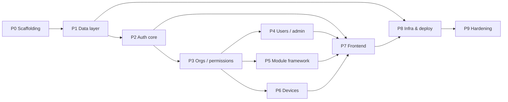

# PatrolKit — Implementation Tasks

Execution breakdown of [IMPLEMENTATION_PLAN.md](IMPLEMENTATION_PLAN.md) into atomic, verifiable
tasks for agentic execution (GitHub Copilot agent mode).

## How to use this file

- Hand an agent **one task at a time**: *"Implement task `P2-T4` from `TASKS.md`. Follow the
  Global Conventions and Guardrails. Stop when the Acceptance criteria pass."*
- Do not start a task until every task in its **Depends on** list is complete.
- Each task is one commit / merge request. Keep scope to the card.

---

## Global Conventions (apply to every task)

- **Stack:** NestJS + TypeScript + Prisma (MySQL) for `apps/api`; React + Vite + TypeScript +
  Tailwind for `apps/web`. Validation via Zod (`nestjs-zod`); contracts in `apps/api/src/contracts/`.
- **Package manager:** pnpm workspace at `server/`. Run API/web via their workspace scripts.
- **API base path:** `/api/v1`. **Response envelope:** success `{ "success": true, "data": … }`;
  error `{ "success": false, "error": "message", "code": "OPTIONAL_CODE" }`.
- **IDs:** cuid. **Timestamps:** `createdAt`/`updatedAt` on mutable models.
- **Validation:** every endpoint validates input with a Zod DTO; reject unknown fields.
- **Tests:** colocate unit tests; integration tests use a disposable MySQL (Testcontainers).
- **Commits:** conventional style, e.g. `feat(auth): magic-link request/verify`.

## Global Guardrails (apply to every task)

- **Foundation only.** Do NOT build any feature module (scheduling, incidents, training,
  equipment, communications) or the mobile app. No password login.
- **Security invariants:** store only **hashes** of magic-link tokens (SHA-256), refresh tokens
  (SHA-256), and device secrets (Argon2id). Never log raw tokens/secrets. Every org-scoped query
  is filtered by `orgId` via `OrgContextGuard`. Uniform 200 on magic-link request (no
  enumeration).
- **Do not** introduce S3/CloudFront, a separate web origin, CORS for the browser, Turborepo, or
  a shared package — the web build is served by the API at the same origin.
- Keep changes within the task's **Touches** paths unless a dependency is genuinely missing.

## Definition of Done (every task)

- [ ] Code compiles: `pnpm -r build` (or the relevant workspace build).
- [ ] Lint/format clean: `pnpm -r lint`.
- [ ] Tests for the task pass; no existing tests broken: `pnpm -r test`.
- [ ] Acceptance criteria on the card are all met.
- [ ] No secrets, raw tokens, or TODOs left in code.

---

## Execution DAG (phase level)

**Notes on parallelism:** After **P3**, the backend slices **P4 / P5 / P6** are independent and
can proceed in parallel. Each **P7** frontend task depends on its corresponding backend slice.
**P8** infra (CDK stacks) can be built once **P1** exists; the first real deploy needs **P7**.

## Ordered task list

| # | Task | Depends on |
|---|---|---|
| P0-T1 | Workspace + tooling | — |
| P0-T2 | API scaffold + health endpoints | P0-T1 |
| P0-T3 | Web scaffold + Tailwind + dev proxy | P0-T1 |
| P0-T4 | Local dev infra (MySQL + Mailpit) | P0-T1 |
| P1-T1 | Prisma schema | P0-T2 |
| P1-T2 | Migration + Prisma module | P1-T1, P0-T4 |
| P1-T3 | Seed (permissions, modules, super admin) | P1-T2 |
| P2-T1 | Auth contracts | P1-T2 |
| P2-T2 | JWT service (EdDSA) | P2-T1 |
| P2-T3 | Mail module (SES + SMTP) | P0-T4 |
| P2-T4 | Magic-link request + verify | P2-T2, P2-T3, P1-T3 |
| P2-T5 | Refresh rotation + logout | P2-T4 |
| P2-T6 | Auth rate limiting | P2-T4 |
| P2-T7 | Access-token guard + `@CurrentUser` | P2-T2 |
| P3-T1 | Org / permission contracts | P2-T1 |
| P3-T2 | Permissions resolution + guard/decorator | P3-T1, P2-T7 |
| P3-T3 | Org context guard + scoped base | P3-T1, P2-T7 |
| P3-T4 | `/me` endpoints | P3-T2 |
| P3-T5 | `GET/PATCH /orgs/:orgId` | P3-T2, P3-T3 |
| P4-T1 | Members/import/admin contracts | P3-T1 |
| P4-T2 | Members list + single invite | P4-T1, P3-T3, P2-T4 |
| P4-T3 | Bulk CSV import | P4-T2 |
| P4-T4 | Update + remove membership | P4-T2 |
| P4-T5 | Permissions catalog endpoint | P4-T1, P3-T3 |
| P4-T6 | Platform org CRUD + super-admin guard | P4-T1, P3-T2 |
| P5-T1 | Module guard + contracts | P3-T1, P3-T3 |
| P5-T2 | Modules list + enable/disable | P5-T1 |
| P6-T1 | Device contracts | P3-T1 |
| P6-T2 | Device provisioning + list | P6-T1, P3-T3 |
| P6-T3 | Device token endpoint | P6-T2, P2-T2 |
| P6-T4 | Rotate/revoke + audit log | P6-T2 |
| P7-T1 | Web API client + token handling | P2-T5, P0-T3 |
| P7-T2 | Landing page port + theme | P0-T3 |
| P7-T3 | Magic-link screens | P7-T1, P2-T4 |
| P7-T4 | App shell + org switcher | P7-T3, P3-T4 |
| P7-T5 | Members screen | P7-T4, P4-T2, P4-T4, P4-T5 |
| P7-T6 | Bulk import UI | P7-T5, P4-T3 |
| P7-T7 | Modules screen | P7-T4, P5-T2 |
| P7-T8 | Devices screen | P7-T4, P6-T2, P6-T4 |
| P7-T9 | Platform admin screen | P7-T4, P4-T6 |
| P8-T1 | Dockerfile + entrypoint bootstrap | P1-T3, P7-T2 |
| P8-T2 | CDK NetworkStack | P1-T1 |
| P8-T3 | CDK DataStack (RDS + Secrets) | P8-T2 |
| P8-T4 | CDK SharedStack (SES, alarms) | P8-T2 |
| P8-T5 | CDK ApiStack (App Runner + domain) | P8-T3, P8-T4, P8-T1 |
| P8-T6 | Deploy scripts + first staging deploy | P8-T5 |
| P9-T1 | Security headers / limits | P2-T7 |
| P9-T2 | Observability + alarms | P8-T5 |
| P9-T3 | Integration test suite + coverage gate | P4-T3, P5-T2, P6-T4 |
| P9-T4 | Production deploy runbook | P8-T6, P9-T3 |

---

## Phase 0 — Scaffolding

### P0-T1 — Workspace + tooling
- **Plan refs:** §2, §3. **Touches:** `server/package.json`, `pnpm-workspace.yaml`,
  `tsconfig.base.json`, `.eslintrc*`, `.prettierrc`, `.gitignore`, `.env.example`.
- **Do:** Create the pnpm workspace with `apps/*` globs, a base tsconfig, ESLint + Prettier,
  root scripts (`build`, `lint`, `test`, `dev`), and a `.env.example` seeded with every variable
  from Plan §11.
- **Acceptance:**
  - [ ] `pnpm install` succeeds at `server/`.
  - [ ] `pnpm lint` and `pnpm build` run (no apps yet is fine — they no-op cleanly).
  - [ ] `.env.example` lists all §11 variables with placeholder values.

### P0-T2 — API scaffold + health endpoints
- **Depends on:** P0-T1. **Plan refs:** §3, §13. **Touches:** `apps/api/**`.
- **Do:** Scaffold a NestJS app with a `ConfigModule` (typed env), pino logging with request IDs,
  the global response-envelope interceptor + exception filter, and `GET /healthz` (liveness) and
  `GET /readyz` (returns ok; DB check added in P1-T2). Global prefix `/api/v1` (health routes may
  sit outside the prefix).
- **Acceptance:**
  - [ ] `pnpm --filter api dev` boots; `GET /healthz` → 200.
  - [ ] Success and error responses use the standard envelope.
  - [ ] Logs are structured JSON with a request id.

### P0-T3 — Web scaffold + Tailwind + dev proxy
- **Depends on:** P0-T1. **Plan refs:** §9. **Touches:** `apps/web/**`.
- **Do:** Scaffold React + Vite + TypeScript + Tailwind + React Router + TanStack Query. Configure
  the Vite dev server to proxy `/api` → the API. Add a placeholder home route.
- **Acceptance:**
  - [ ] `pnpm --filter web dev` serves the app; a fetch to `/api/healthz` proxies to the API.
  - [ ] Tailwind builds; base layout renders.

### P0-T4 — Local dev infra (MySQL + Mailpit)
- **Depends on:** P0-T1. **Plan refs:** §16. **Touches:** `docker/docker-compose.yml`, README.
- **Do:** Compose MySQL 8 and Mailpit with sensible local env. Document `pnpm dev` and how to view
  captured magic-link emails in Mailpit.
- **Acceptance:**
  - [ ] `docker compose up -d` starts MySQL + Mailpit.
  - [ ] `DATABASE_URL` in `.env.example` points at the local MySQL.
  - [ ] Mailpit UI reachable locally.

---

## Phase 1 — Data layer

### P1-T1 — Prisma schema
- **Depends on:** P0-T2. **Plan refs:** §4. **Touches:** `apps/api/prisma/schema.prisma`.
- **Do:** Transcribe the full schema from Plan §4 exactly (User, Organization, Membership,
  Permission, MembershipPermission, ModuleCatalog, OrgModule, MagicLink, RefreshToken, Device,
  DevicePermission, AuditLog), MySQL provider.
- **Acceptance:**
  - [ ] `pnpm --filter api prisma validate` passes.
  - [ ] All relations, unique constraints, and indexes from §4 are present.

### P1-T2 — Migration + Prisma module
- **Depends on:** P1-T1, P0-T4. **Plan refs:** §4, §13. **Touches:** `apps/api/prisma/migrations/**`,
  `apps/api/src/**` (Prisma service).
- **Do:** Create the initial migration, generate the client, add an injectable `PrismaService`,
  and wire the DB check into `GET /readyz`.
- **Acceptance:**
  - [ ] `prisma migrate dev` applies cleanly against local MySQL.
  - [ ] `GET /readyz` returns 200 only when the DB is reachable.

### P1-T3 — Seed (permissions, modules, super admin)
- **Depends on:** P1-T2. **Plan refs:** §5.1, §6, §8, §16. **Touches:** `apps/api/prisma/seed.ts`.
- **Do:** Idempotent seed that upserts the §6 permission catalog, the `user_management` core
  module (`isCore=true`), and a super admin from `SEED_SUPERADMIN_EMAIL` (create or promote,
  no password). Optionally a demo org + owner membership for local dev.
- **Acceptance:**
  - [ ] Running the seed twice yields no duplicates and no errors.
  - [ ] All §6 permission keys exist; core module exists.
  - [ ] `SEED_SUPERADMIN_EMAIL` user exists with `isSuperAdmin=true`.

---

## Phase 2 — Auth core

### P2-T1 — Auth contracts
- **Depends on:** P1-T2. **Plan refs:** §7 (Auth). **Touches:** `apps/api/src/contracts/auth.*`.
- **Do:** Zod schemas + inferred types for every auth request/response (magic-link request/verify,
  refresh, logout, device token).
- **Acceptance:** [ ] Types exported for reuse by handlers and the web app; unit tests cover
  valid/invalid parsing.

### P2-T2 — JWT service (EdDSA)
- **Depends on:** P2-T1. **Plan refs:** §2, §5.2. **Touches:** `apps/api/src/auth/jwt.*`.
- **Do:** Load EdDSA (Ed25519) keys from env/secrets; sign/verify access tokens (`sub=userId`,
  ~15m) and device tokens (~1h, claims `deviceId`, `orgId`, `permissions`). Config-driven TTLs.
- **Acceptance:**
  - [ ] Round-trip sign/verify works; tampered/expired tokens rejected.
  - [ ] Algorithm is EdDSA; no secret material logged.

### P2-T3 — Mail module (SES + SMTP)
- **Depends on:** P0-T4. **Plan refs:** §2, §11. **Touches:** `apps/api/src/mail/**`.
- **Do:** Mail service with `MAIL_TRANSPORT` switch (`ses` | `smtp`), a magic-link email template,
  and `EMAIL_FROM`. Local dev uses SMTP → Mailpit.
- **Acceptance:**
  - [ ] In local dev, a test send appears in Mailpit.
  - [ ] Transport chosen by env; failures are logged, not thrown to the caller.

### P2-T4 — Magic-link request + verify
- **Depends on:** P2-T2, P2-T3, P1-T3. **Plan refs:** §5.1, §7. **Touches:** `apps/api/src/auth/**`.
- **Do:** `POST /auth/magic-link` (always 200; if active user, store SHA-256 of a 32-byte token,
  15m expiry, email raw token). `POST /auth/magic-link/verify` (validate hash, not-used,
  not-expired → mark used → issue access token + set refresh cookie).
- **Acceptance:**
  - [ ] Request returns 200 for unknown emails without sending (no enumeration).
  - [ ] Only the token hash is persisted; raw token only in the email.
  - [ ] Verify issues an access token and an httpOnly, Secure, SameSite=Strict refresh cookie.
  - [ ] Used/expired tokens are rejected.

### P2-T5 — Refresh rotation + logout
- **Depends on:** P2-T4. **Plan refs:** §5.2, §7. **Touches:** `apps/api/src/auth/**`.
- **Do:** `POST /auth/refresh` (read refresh cookie, verify hash + not-revoked + not-expired,
  rotate: revoke old, issue new, reset cookie). `POST /auth/logout` (revoke + clear cookie).
- **Acceptance:**
  - [ ] Refresh rotates the token and revokes the previous one.
  - [ ] A revoked/expired refresh token is rejected.
  - [ ] Logout clears the cookie and revokes the token.

### P2-T6 — Auth rate limiting
- **Depends on:** P2-T4. **Plan refs:** §12. **Touches:** `apps/api/src/auth/**`, throttler config.
- **Do:** Rate-limit `magic-link` (per IP + per email) and `refresh` (per IP). Return 429 with the
  standard envelope.
- **Acceptance:** [ ] Exceeding the limit returns 429; normal use is unaffected; limits are
  config-driven.

### P2-T7 — Access-token guard + `@CurrentUser`
- **Depends on:** P2-T2. **Plan refs:** §5.3. **Touches:** `apps/api/src/common/**`.
- **Do:** `AuthGuard` that validates the bearer access token and attaches the user; a
  `@CurrentUser()` param decorator. 401 on missing/invalid token.
- **Acceptance:** [ ] Protected routes reject anonymous requests; `@CurrentUser()` resolves the
  authenticated user id/email.

---

## Phase 3 — Orgs, membership & permissions

### P3-T1 — Org / permission contracts
- **Depends on:** P2-T1. **Plan refs:** §7. **Touches:** `apps/api/src/contracts/*`.
- **Do:** Zod contracts for `/me`, org read/update, and the permission-key enum from §6.
- **Acceptance:** [ ] Permission-key enum matches §6 exactly; contracts unit-tested.

### P3-T2 — Permissions resolution + guard/decorator
- **Depends on:** P3-T1, P2-T7. **Plan refs:** §5.3, §5.5. **Touches:** `apps/api/src/permissions/**`,
  `apps/api/src/common/**`.
- **Do:** Service that resolves a membership's effective permission keys (short-lived cache);
  `PermissionsGuard` + `@RequirePermissions(...)`. `isSuperAdmin` bypasses only platform/admin
  checks.
- **Acceptance:**
  - [ ] A user lacking a required permission gets 403.
  - [ ] Granting the permission allows the request.
  - [ ] Resolution is scoped to the request's org.

### P3-T3 — Org context guard + scoped base
- **Depends on:** P3-T1, P2-T7. **Plan refs:** §5.3, §12. **Touches:** `apps/api/src/common/**`,
  `apps/api/src/orgs/**`.
- **Do:** `OrgContextGuard` loads the caller's active `Membership` for `:orgId` (404/403 if
  none/inactive) and exposes it to handlers. Establish the `/orgs/:orgId` routing convention.
- **Acceptance:**
  - [ ] Requests to an org the user doesn't belong to return 403.
  - [ ] Switching orgs works by calling a different `:orgId` (no re-auth).

### P3-T4 — `/me` endpoints
- **Depends on:** P3-T2. **Plan refs:** §5.3, §7. **Touches:** `apps/api/src/me/**`.
- **Do:** `GET /me` (user + memberships with per-org permission keys) and `PATCH /me` (name).
- **Acceptance:** [ ] `/me` returns memberships + permissions sufficient for the web org switcher
  and UI gating.

### P3-T5 — `GET/PATCH /orgs/:orgId`
- **Depends on:** P3-T2, P3-T3. **Plan refs:** §7. **Touches:** `apps/api/src/orgs/**`.
- **Do:** `GET /orgs/:orgId` (`org:read`) returns org details + enabled modules; `PATCH` (`org:manage`)
  updates settings.
- **Acceptance:** [ ] Reads require `org:read`, updates require `org:manage`; enabled modules
  included in the read.

---

## Phase 4 — User management & platform admin

### P4-T1 — Members/import/admin contracts
- **Depends on:** P3-T1. **Plan refs:** §7. **Touches:** `apps/api/src/contracts/*`.
- **Do:** Contracts for members list/invite, membership update, CSV import (incl. `sendInvites`),
  and platform org CRUD.
- **Acceptance:** [ ] Contracts cover all fields/params in §7; unit-tested.

### P4-T2 — Members list + single invite
- **Depends on:** P4-T1, P3-T3, P2-T4. **Plan refs:** §7. **Touches:** `apps/api/src/members/**`.
- **Do:** `GET /orgs/:orgId/members` (`users:read`, includes permission keys). `POST
  /orgs/:orgId/members` (`users:invite`): create user if needed, add membership, send magic-link
  onboarding.
- **Acceptance:**
  - [ ] Listing requires `users:read`.
  - [ ] Inviting an existing email reuses the user and adds membership.
  - [ ] Invite sends a magic link.

### P4-T3 — Bulk CSV import
- **Depends on:** P4-T2. **Plan refs:** §7 (Bulk import CSV contract). **Touches:** `apps/api/src/members/**`.
- **Do:** `POST /orgs/:orgId/members/import` (`users:import`), multipart `file`. Columns
  `email,name,permissions` (`;`-separated). **Max 500 rows**, synchronous, transactional per row.
  **No email by default**; `sendInvites` (boolean, default false) opts in. Return per-row outcome
  (`created` | `already_member` | `invited` | `error`).
- **Acceptance:**
  - [ ] >500 rows rejected with 413/422 + clear message.
  - [ ] Default run sends **no** emails; `sendInvites=true` sends one per new/added user.
  - [ ] Response reports every row's outcome; invalid rows don't abort valid ones.

### P4-T4 — Update + remove membership
- **Depends on:** P4-T2. **Plan refs:** §7. **Touches:** `apps/api/src/members/**`.
- **Do:** `PATCH /orgs/:orgId/members/:userId` — status (`users:manage`) and/or permission set
  (`permissions:assign`). `DELETE` — remove membership (`users:manage`).
- **Acceptance:**
  - [ ] Permission changes require `permissions:assign`; status/removal require `users:manage`.
  - [ ] Removing a membership cascades its `MembershipPermission` rows.

### P4-T5 — Permissions catalog endpoint
- **Depends on:** P4-T1, P3-T3. **Plan refs:** §6, §7. **Touches:** `apps/api/src/permissions/**`.
- **Do:** `GET /orgs/:orgId/permissions` (`users:read`) → assignable permission keys + descriptions.
- **Acceptance:** [ ] Returns the full §6 catalog.

### P4-T6 — Platform org CRUD + super-admin guard
- **Depends on:** P4-T1, P3-T2. **Plan refs:** §7 (Platform). **Touches:** `apps/api/src/platform/**`,
  `apps/api/src/common/**`.
- **Do:** `SuperAdminGuard`; `/admin/organizations` list/create/read/update/delete. Create seeds an
  owner membership (all §6 permissions) + the core module.
- **Acceptance:**
  - [ ] All `/admin/*` routes require `isSuperAdmin`.
  - [ ] Creating an org seeds owner membership + `user_management` core module.

---

## Phase 5 — Module framework

### P5-T1 — Module guard + contracts
- **Depends on:** P3-T1, P3-T3. **Plan refs:** §8. **Touches:** `apps/api/src/modules/**`,
  `apps/api/src/contracts/*`.
- **Do:** `ModuleEnabledGuard` + `@RequireModule(key)`; module contracts. Ship the guard/catalog
  only — no feature modules.
- **Acceptance:** [ ] A route guarded by a disabled module returns 403/404 consistently; core
  modules always pass.

### P5-T2 — Modules list + enable/disable
- **Depends on:** P5-T1. **Plan refs:** §7, §8. **Touches:** `apps/api/src/modules/**`.
- **Do:** `GET /orgs/:orgId/modules` (`org:read`) — modules + enabled state. `PATCH
  /orgs/:orgId/modules/:key` (`modules:manage`) — enable/disable; **core cannot be disabled**.
- **Acceptance:**
  - [ ] Disabling a core module is rejected.
  - [ ] Enable/disable persists `enabled`, `enabledAt`, `enabledBy`.

---

## Phase 6 — Devices

### P6-T1 — Device contracts
- **Depends on:** P3-T1. **Plan refs:** §5.4, §7. **Touches:** `apps/api/src/contracts/*`.
- **Do:** Contracts for provision (name + permissions), provision response (clientId + one-time
  secret), device token request, list, rotate, revoke.
- **Acceptance:** [ ] Contracts unit-tested; secret only present in the provision/rotate response.

### P6-T2 — Device provisioning + list
- **Depends on:** P6-T1, P3-T3. **Plan refs:** §5.4, §7, §12. **Touches:** `apps/api/src/devices/**`.
- **Do:** `POST /orgs/:orgId/devices` (`devices:provision`) → generate `clientId` + secret, store
  **Argon2id hash**, return the secret **once**. `GET /orgs/:orgId/devices` (`devices:read`).
- **Acceptance:**
  - [ ] Secret is returned exactly once and never retrievable again.
  - [ ] Only the secret hash is stored; device is scoped to the org.

### P6-T3 — Device token endpoint
- **Depends on:** P6-T2, P2-T2. **Plan refs:** §5.4. **Touches:** `apps/api/src/auth/**`.
- **Do:** `POST /auth/device/token` (`clientId` + `clientSecret`) → verify against hash + active
  status → issue device access token (~1h, claims `deviceId`, `orgId`, `permissions`). Update
  `lastSeenAt`.
- **Acceptance:**
  - [ ] Valid credentials yield a device token; a revoked device is refused.
  - [ ] Wrong secret returns 401; no timing/enumeration leak.

### P6-T4 — Rotate/revoke + audit log
- **Depends on:** P6-T2. **Plan refs:** §5.4, §12, §13. **Touches:** `apps/api/src/devices/**`,
  `apps/api/src/common/audit/**`.
- **Do:** `POST /orgs/:orgId/devices/:id/rotate-secret` (`devices:provision`, new secret once);
  `DELETE /orgs/:orgId/devices/:id` (`devices:revoke`). Add an `AuditLog` writer and record device
  provision/rotate/revoke, permission changes, and imports.
- **Acceptance:**
  - [ ] Rotate invalidates the old secret; revoke blocks the token endpoint.
  - [ ] Audited actions produce `AuditLog` rows with actor + org + metadata.

---

## Phase 7 — Frontend

### P7-T1 — Web API client + token handling
- **Depends on:** P2-T5, P0-T3. **Plan refs:** §9. **Touches:** `apps/web/src/lib/**`.
- **Do:** Typed API client (import contracts via path alias), access token in memory, refresh
  cookie sent automatically, silent refresh on 401, TanStack Query setup.
- **Acceptance:** [ ] A 401 triggers one refresh + retry; access token is never written to
  localStorage.

### P7-T2 — Landing page port + theme
- **Depends on:** P0-T3. **Plan refs:** §9. **Touches:** `apps/web/public/landing.html`,
  Tailwind config.
- **Do:** Port `patrolkit/web/public/landing.html` as-is; align Tailwind tokens (dark `surface`,
  red `brand` ramp, Inter + Plus Jakarta Sans).
- **Acceptance:** [ ] Landing renders with original styling; theme tokens available to the SPA.

### P7-T3 — Magic-link screens
- **Depends on:** P7-T1, P2-T4. **Plan refs:** §9. **Touches:** `apps/web/src/pages/auth/**`.
- **Do:** Request screen (email) and verify/callback route that exchanges the token and lands the
  user in the app.
- **Acceptance:** [ ] Full local flow works end to end via Mailpit.

### P7-T4 — App shell + org switcher
- **Depends on:** P7-T3, P3-T4. **Plan refs:** §9. **Touches:** `apps/web/src/components/**`.
- **Do:** Authenticated shell (sidebar/nav), org switcher from `GET /me`, permission-gated nav
  items, protected routes.
- **Acceptance:** [ ] Switching orgs re-scopes the UI; nav hides actions the user lacks permission
  for.

### P7-T5 — Members screen
- **Depends on:** P7-T4, P4-T2, P4-T4, P4-T5. **Plan refs:** §9. **Touches:** `apps/web/src/pages/members/**`.
- **Do:** Members list, single invite, permission assignment UI (from the catalog), remove member.
- **Acceptance:** [ ] All actions gated by permissions; optimistic/refetch updates via TanStack Query.

### P7-T6 — Bulk import UI
- **Depends on:** P7-T5, P4-T3. **Plan refs:** §9. **Touches:** `apps/web/src/pages/members/**`.
- **Do:** CSV upload with a **Send onboarding emails** toggle (default off) and a per-row results
  view.
- **Acceptance:** [ ] Emails off by default; results table shows each row's outcome.

### P7-T7 — Modules screen
- **Depends on:** P7-T4, P5-T2. **Plan refs:** §9. **Touches:** `apps/web/src/pages/modules/**`.
- **Do:** List modules with enable/disable toggles; core shown as locked-on.
- **Acceptance:** [ ] Toggling persists; core cannot be disabled in the UI.

### P7-T8 — Devices screen
- **Depends on:** P7-T4, P6-T2, P6-T4. **Plan refs:** §9. **Touches:** `apps/web/src/pages/devices/**`.
- **Do:** Device list, provision flow with a **show-secret-once** modal, rotate, revoke.
- **Acceptance:** [ ] Secret shown once with a copy affordance; rotate/revoke reflected in the list.

### P7-T9 — Platform admin screen
- **Depends on:** P7-T4, P4-T6. **Plan refs:** §9. **Touches:** `apps/web/src/pages/admin/**`.
- **Do:** Super-admin org list + create; visible only to `isSuperAdmin`.
- **Acceptance:** [ ] Hidden for non-super-admins; create org works.

---

## Phase 8 — Infrastructure & deploy

### P8-T1 — Dockerfile + entrypoint bootstrap
- **Depends on:** P1-T3, P7-T2. **Plan refs:** §10, §15. **Touches:** `apps/api/Dockerfile`,
  entrypoint script.
- **Do:** Multi-stage build: build `web` then `api`, copy the web `dist/` into the image for
  NestJS to serve. Entrypoint runs `prisma migrate deploy` + the idempotent seed, then starts the
  server.
- **Acceptance:**
  - [ ] `docker build` produces one image serving both web and `/api/v1`.
  - [ ] On boot, migrations + seed run before traffic is served.

### P8-T2 — CDK NetworkStack
- **Depends on:** P1-T1. **Plan refs:** §10. **Touches:** `infra/**`.
- **Do:** VPC with public + private subnets, security groups, App Runner VPC connector.
- **Acceptance:** [ ] `cdk synth` succeeds; RDS subnets are private.

### P8-T3 — CDK DataStack
- **Depends on:** P8-T2. **Plan refs:** §10. **Touches:** `infra/**`.
- **Do:** RDS **MySQL 8, single-AZ**, `db.t4g.micro`, private; Secrets Manager entries for DB creds
  + EdDSA keys.
- **Acceptance:** [ ] `cdk synth` succeeds; RDS is not publicly accessible; secrets defined.

### P8-T4 — CDK SharedStack
- **Depends on:** P8-T2. **Plan refs:** §10, §13. **Touches:** `infra/**`.
- **Do:** SES identity/config for `patrolkit.io` (DKIM), CloudWatch alarms (API 5xx, RDS CPU/conns,
  App Runner health).
- **Acceptance:** [ ] `cdk synth` succeeds; alarms + SES identity defined.

### P8-T5 — CDK ApiStack
- **Depends on:** P8-T3, P8-T4, P8-T1. **Plan refs:** §10. **Touches:** `infra/**`.
- **Do:** ECR repo; App Runner service (serves web + API) with the VPC connector, env wiring from
  Secrets Manager, custom domain `patrolkit.io` + Route53, `www` → apex redirect, SES VPC endpoint.
- **Acceptance:** [ ] `cdk synth` succeeds; service reachable at the apex; `www` redirects.

### P8-T6 — Deploy scripts + first staging deploy
- **Depends on:** P8-T5. **Plan refs:** §15. **Touches:** `server/package.json` scripts, README.
- **Do:** `build`, `image:build`, `image:push` (ECR), `release` (App Runner), `infra:deploy` (CDK).
  Perform the first staging deploy from the dev machine.
- **Acceptance:**
  - [ ] Each script runs standalone.
  - [ ] Staging serves the app; the magic-link flow works against RDS.

---

## Phase 9 — Hardening

### P9-T1 — Security headers / limits
- **Depends on:** P2-T7. **Plan refs:** §12. **Touches:** `apps/api/src/**`.
- **Do:** Helmet-equivalent headers, request body size limits (esp. CSV upload), confirm no
  browser CORS is enabled (same origin). Ensure token/secret material is never logged.
- **Acceptance:** [ ] Security headers present; oversized bodies rejected; no CORS headers for the
  web app.

### P9-T2 — Observability + alarms
- **Depends on:** P8-T5. **Plan refs:** §13. **Touches:** `apps/api/src/**`, `infra/**`.
- **Do:** Finalize structured logging, ship to CloudWatch, verify alarms fire, confirm
  `/healthz` + `/readyz` used by App Runner health checks.
- **Acceptance:** [ ] Logs in CloudWatch; alarms validated; health checks green.

### P9-T3 — Integration test suite + coverage gate
- **Depends on:** P4-T3, P5-T2, P6-T4. **Plan refs:** §14. **Touches:** `apps/api/test/**`.
- **Do:** Testcontainers MySQL e2e covering auth flows, permission enforcement, **org isolation**,
  module gating, device provisioning/token/revoke, and bulk import. Add a coverage gate on `auth`,
  `permissions`, `orgs`, `devices`.
- **Acceptance:** [ ] Suite passes from clean; coverage gate enforced; org-isolation test proves
  cross-org access is blocked.

### P9-T4 — Production deploy runbook
- **Depends on:** P8-T6, P9-T3. **Plan refs:** §15, §16. **Touches:** `README`/`docs`.
- **Do:** Document the prod deploy (SSO login, `cdk deploy`, image push, release), the
  `SEED_SUPERADMIN_EMAIL` bootstrap, first-login verification, and rollback.
- **Acceptance:** [ ] A new operator can deploy prod and confirm the super admin can sign in by
  following the runbook.
