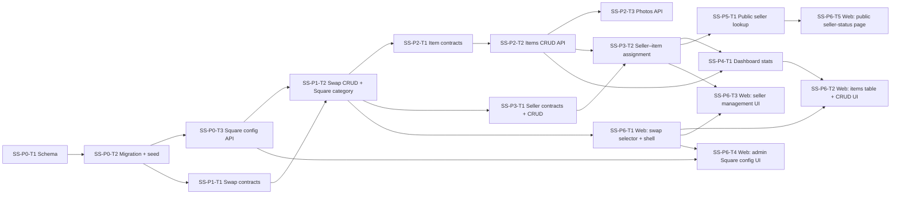

# PatrolKit — Ski Swap Module Implementation Plan

> **Status:** Draft v1 — living document. Consumed by an implementing LLM one task at a time.
> Prerequisite: the Phase 1 foundation (auth, orgs, permissions, module framework) is complete.

---

## 1. Overview & Goals

The **Ski Swap** module adds a consignment-swap management workflow on top of the existing
PatrolKit foundation. Square serves as the point-of-sale backend: items live in the
organization's own Square account and are sold through their existing Square POS. PatrolKit
manages swap metadata, seller records, and surfaces manager/seller-facing UIs.

### In scope
- Create and manage named swaps (e.g., "Ski Swap 2026"), each mapped to a Square category.
- Per-swap item management via the Square **Catalog**, **Inventory**, and **Orders** APIs.
- Seller records stored locally (name, phone, email, street, city, state, zip); each Square item is mapped to a
  seller via a join table.
- Swap-level permissions (`ski_swap:report`, `ski_swap:manage`, `ski_swap:admin`).
- Manager web UI: swap selector dropdown, searchable/filterable items table, add/edit/remove
  items, dashboard stat tiles.
- Admin web UI: Square API credential configuration.
- **Public seller-status page** (org-gated by slug, no login): sellers enter a phone number to
  see the sale status of their items.
- iOS companion app API: same authenticated endpoints as the web manager, accessed via the
  existing device-token auth.

### Explicitly out of scope
- Taking payments or creating orders through PatrolKit (Square POS handles all transactions).
- Multi-location Square inventory routing.
- Email or SMS notifications to sellers.
- Any migration of data from the legacy PatrolKit app.

---

## 2. Square Integration

Two Square APIs are required. All calls are made server-side using the org's stored access token.

| API | Usage |
|---|---|
| **Catalog API** | Create/read/update/delete items (`CatalogItem` + `CatalogItemVariation`) and categories (`CatalogCategory`). Upload item photos via the Catalog Images endpoint. |
| **Inventory API** | Set initial `IN_STOCK` quantity when an item is created. Read current inventory counts for the items table, seller-status page, and dashboard stats. |

**Required Square OAuth scopes:** `ITEMS_READ`, `ITEMS_WRITE`, `INVENTORY_READ`, `INVENTORY_WRITE`.

**Square Node.js SDK:** add the official `squareup` package to `apps/api`.

**Square-Version header:** all API calls must include a pinned `Square-Version` date header (e.g., `2026-07-16`). Pin to the version used during development and update deliberately; do not use `"latest"`.

### Square object model for a swap item

Each PatrolKit item maps to a `CatalogItem` containing exactly **one** `CatalogItemVariation`
(no size/color variants). The variation holds the `sku` and `price_money`. The item's
`category_id` links it to the swap category:

```
CatalogCategory  ("PatrolKit/Ski Swap 2026")
  └─ CatalogItem           (name, description, photos)
       └─ CatalogItemVariation  (sku, price_money)
```

### Inventory flow

1. PatrolKit creates item in Square Catalog → receives `squareItemId` + `squareVariationId`.
2. PatrolKit calls `BatchChangeInventory` with a `RECEIVE_STOCK` adjustment to set `quantity`
   units `IN_STOCK` at the org's Square location.
3. The Square POS decrements inventory as items are sold.
4. PatrolKit reads `BatchRetrieveInventoryCounts` to display current stock.
5. `soldCount = originalQuantity − currentInStock` — `originalQuantity` is stored locally.

---

## 3. Data Model

New Prisma models to append to `apps/api/prisma/schema.prisma`. Existing models are unchanged.

```prisma
// ─── Ski Swap ──────────────────────────────────────────────────────────────

// Encrypted Square credentials per org
model SquareConfig {
  id             String   @id @default(cuid())
  orgId          String   @unique
  locationId     String                      // Square location ID
  accessTokenEnc String   @db.Text           // AES-256-GCM JSON: { iv, tag, ct }
  environment    String   @default("production") // "sandbox" | "production"
  createdAt      DateTime @default(now())
  updatedAt      DateTime @updatedAt

  org Organization @relation(fields: [orgId], references: [id], onDelete: Cascade)
}

// A named swap event — multiple may be active simultaneously per org
model SkiSwap {
  id               String   @id @default(cuid())
  orgId            String
  title            String                    // e.g. "Ski Swap 2026"
  squareCategoryId String                    // Square CatalogCategory ID
  active           Boolean  @default(false)
  skuPrefix        String                    // Derived from title on creation, e.g. "SS26"
  skuCounter       Int      @default(0)      // Incremented per new item (atomic)
  createdBy        String?
  createdAt        DateTime @default(now())
  updatedAt        DateTime @updatedAt

  org         Organization   @relation(fields: [orgId], references: [id], onDelete: Cascade)
  sellerItems SwapItemSeller[]

  @@unique([orgId, title])
  @@index([orgId, active])
}

// Seller records — managed locally; linked to Square items via SwapItemSeller
model SwapSeller {
  id        String   @id @default(cuid())
  orgId     String
  name      String
  phone     String                            // Normalized E.164 or stripped digits
  email     String?
  street    String?
  city      String?
  state     String?
  zip       String?
  createdAt DateTime @default(now())
  updatedAt DateTime @updatedAt

  org       Organization   @relation(fields: [orgId], references: [id], onDelete: Cascade)
  swapItems SwapItemSeller[]

  @@index([orgId, phone])
}

// Maps a Square Catalog item to a seller for a specific swap
model SwapItemSeller {
  id                String   @id @default(cuid())
  swapId            String
  sellerId          String
  squareItemId      String                    // Square CatalogItem ID
  squareVariationId String                    // Square CatalogItemVariation ID
  originalQuantity  Int
  createdAt         DateTime @default(now())

  swap   SkiSwap    @relation(fields: [swapId], references: [id], onDelete: Cascade)
  seller SwapSeller @relation(fields: [sellerId], references: [id])

  @@unique([swapId, squareItemId])
  @@index([sellerId])
}
```

### Organization model additions

Add the following relations to the existing `Organization` model:

```prisma
squareConfig  SquareConfig?
skiSwaps      SkiSwap[]
swapSellers   SwapSeller[]
```

---

## 4. Permission Catalog Additions

Add three new keys to `apps/api/src/contracts/org.contracts.ts` (`PermissionKeySchema`) and to
the seed in `apps/api/prisma/seed.ts`.

| Key | Description |
|---|---|
| `ski_swap:report` | Minimum access: view items, stats, and seller records. Also gates module visibility in the nav — users without this key do not see Ski Swap. |
| `ski_swap:manage` | Read/write items and sellers. Implies `ski_swap:report`. |
| `ski_swap:admin` | Configure Square credentials. Implies `ski_swap:manage`. |

**Enforcement:** each permission key is checked individually by `PermissionsGuard`. There is no
automatic implication chain in the DB — when granting `ski_swap:manage` to a membership,
also grant `ski_swap:report` explicitly. The org owner seed row should receive all three keys
when the module is provisioned.

---

## 5. Module Registration

Add the `ski_swap` module entry to the idempotent seed:

```ts
await prisma.moduleCatalog.upsert({
  where: { key: 'ski_swap' },
  update: { name: 'Ski Swap', description: 'Consignment ski swap management powered by Square POS.' },
  create: { key: 'ski_swap', name: 'Ski Swap', description: 'Consignment ski swap management powered by Square POS.', isCore: false },
});
```

`isCore: false` — the module is **disabled by default** for all orgs. A user with
`modules:manage` enables it via the existing `PATCH /orgs/:orgId/modules/ski_swap` endpoint.

All Ski Swap controller routes (except the public seller-lookup endpoint) must be decorated
with `@RequireModule('ski_swap')` and guarded by `ModuleEnabledGuard`, consistent with the
module framework described in the foundation plan §8.

---

## 6. API Surface

Base path: `/api/v1`. Standard response envelope applies. All endpoints below (except the
public one) are guarded by `JwtAuthGuard`, `OrgContextGuard`, `ModuleEnabledGuard('ski_swap')`,
and `PermissionsGuard`.

### Square Configuration

| Method | Path | Permission | Notes |
|---|---|---|---|
| GET | `/orgs/:orgId/ski-swap/config` | `ski_swap:admin` | Returns config; access token is masked (`"***"`). |
| PUT | `/orgs/:orgId/ski-swap/config` | `ski_swap:admin` | Upsert Square credentials. Writes to `AuditLog`. |
| DELETE | `/orgs/:orgId/ski-swap/config` | `ski_swap:admin` | Remove credentials. Writes to `AuditLog`. |

### Swaps

| Method | Path | Permission | Notes |
|---|---|---|---|
| GET | `/orgs/:orgId/ski-swap/swaps` | `ski_swap:report` | List all swaps for the org, ordered by `createdAt` desc. Optional `?active=true` filter. |
| POST | `/orgs/:orgId/ski-swap/swaps` | `ski_swap:admin` | Create a swap; creates the Square category (`PatrolKit/<title>`); derives `skuPrefix` from title. |
| GET | `/orgs/:orgId/ski-swap/swaps/:swapId` | `ski_swap:report` | Single swap detail. |
| PATCH | `/orgs/:orgId/ski-swap/swaps/:swapId` | `ski_swap:admin` | Update `title` and/or `active`. A title change renames the Square category. |
| DELETE | `/orgs/:orgId/ski-swap/swaps/:swapId` | `ski_swap:admin` | Delete swap record. Does **not** delete items from Square. Fails if any `SwapItemSeller` rows exist. |

### Items (Square Catalog / Inventory passthrough)

| Method | Path | Permission | Notes |
|---|---|---|---|
| GET | `/orgs/:orgId/ski-swap/swaps/:swapId/items` | `ski_swap:report` | Proxy to Square `SearchCatalogItems`, filtered by `squareCategoryId`. Supports `cursor`, `limit`, `query` (name/SKU prefix search). Enriches each item with current `IN_STOCK` count and seller info. |
| POST | `/orgs/:orgId/ski-swap/swaps/:swapId/items` | `ski_swap:manage` | Create item in Square Catalog; set initial inventory via `BatchChangeInventory`; auto-generate SKU; create `SwapItemSeller` if `sellerId` provided. |
| GET | `/orgs/:orgId/ski-swap/swaps/:swapId/items/:squareItemId` | `ski_swap:report` | Single item detail from Square; includes current inventory and seller info. |
| PATCH | `/orgs/:orgId/ski-swap/swaps/:swapId/items/:squareItemId` | `ski_swap:manage` | Update item in Square Catalog (name, description, price). Quantity changes use `BatchChangeInventory` with a `PHYSICAL_COUNT` (absolute value) — see §7.7. Catalog field changes require fetching the current Square `version` first — see §7.8. |
| DELETE | `/orgs/:orgId/ski-swap/swaps/:swapId/items/:squareItemId` | `ski_swap:manage` | Archive item in Square (`is_deleted: true`). Removes associated `SwapItemSeller` row. |
| POST | `/orgs/:orgId/ski-swap/swaps/:swapId/items/:squareItemId/images` | `ski_swap:manage` | Upload photo (`multipart/form-data`, field `image`). Proxies to Square Images API; attaches returned `imageId` to the item. |
| DELETE | `/orgs/:orgId/ski-swap/swaps/:swapId/items/:squareItemId/images/:imageId` | `ski_swap:manage` | Delete a photo from Square and detach from the item. |

### Sellers

| Method | Path | Permission | Notes |
|---|---|---|---|
| GET | `/orgs/:orgId/ski-swap/sellers` | `ski_swap:report` | List sellers. Supports `query` (name/phone search). |
| POST | `/orgs/:orgId/ski-swap/sellers` | `ski_swap:manage` | Create seller. |
| GET | `/orgs/:orgId/ski-swap/sellers/:sellerId` | `ski_swap:report` | Seller detail + items across swaps (with current inventory from Square). |
| PATCH | `/orgs/:orgId/ski-swap/sellers/:sellerId` | `ski_swap:manage` | Update seller info. |
| DELETE | `/orgs/:orgId/ski-swap/sellers/:sellerId` | `ski_swap:manage` | Delete seller. Returns 409 if active `SwapItemSeller` mappings exist. |

### Seller–Item Assignment

| Method | Path | Permission | Notes |
|---|---|---|---|
| PUT | `/orgs/:orgId/ski-swap/swaps/:swapId/items/:squareItemId/seller` | `ski_swap:manage` | Assign (or reassign) a seller. Body: `{ sellerId }`. |
| DELETE | `/orgs/:orgId/ski-swap/swaps/:swapId/items/:squareItemId/seller` | `ski_swap:manage` | Unassign seller from item. |

### Dashboard Stats

| Method | Path | Permission | Notes |
|---|---|---|---|
| GET | `/orgs/:orgId/ski-swap/swaps/:swapId/stats` | `ski_swap:report` | Aggregated stats (see §7). |

### Public Seller Lookup *(no auth)*

| Method | Path | Notes |
|---|---|---|
| GET | `/api/v1/public/:orgSlug/ski-swap/seller-lookup` | No JWT required. Query params: `phone` (required), `swapId` (optional — defaults to all active swaps). Rate-limited to 20 req/min per IP. |

---

## 7. Implementation Details

### 7.1 Square category sync

`POST .../swaps` calls Square `UpsertCatalogObject`:
```json
{ "type": "CATEGORY", "category_data": { "name": "PatrolKit/<title>" } }
```
The returned `id` is stored as `SkiSwap.squareCategoryId`. A title `PATCH` issues an update to
the same Square object. The category is **never deleted** when a swap is deleted from PatrolKit.

### 7.2 SKU auto-generation

`skuPrefix` is derived from the swap title at creation time: extract the 4-digit year if
present, then take the first 2 letters of each significant word, uppercase. Examples:
- "Ski Swap 2026" → `SS26`
- "Fall Swap 2025" → `FS25`

The SKU assigned to a new item is:
```
{skuPrefix}-{skuCounter.toString().padStart(4, '0')}
```
e.g., `SS26-0042`. The `skuCounter` is incremented atomically inside a Prisma transaction to
prevent duplicate SKUs under concurrent creates.

**Barcode compatibility:** the format uses only uppercase letters, digits, and hyphens — the
full character set of **Code 39**, and a strict subset of **Code 128**. Both are standard 1D
barcodes supported by Square POS scanners. Physical item tags should encode the SKU as a
**Code 128** barcode (denser and more reliable than Code 39 for short strings). Character
constraints to enforce at validation time: `^[A-Z0-9\-]{1,20}$`. Do not allow lowercase
letters, spaces, or other punctuation — they are valid in Code 128 but break Code 39
compatibility and complicate label printing.

### 7.3 Dashboard stats

`GET .../stats` assembles and returns:

| Field | Source |
|---|---|
| `totalItems` | `SearchCatalogItems` by `squareCategoryId`; total count. |
| `totalSellers` | `COUNT(DISTINCT sellerId)` from `SwapItemSeller WHERE swapId = ?`. |
| `itemsSold` | `Σ (originalQty − currentInStock)` across all `SwapItemSeller` for the swap. |
| `grossRevenue` | `Σ (catalogPrice × soldCount)` using prices from Square Catalog. Best-effort estimate; does not account for POS discounts or refunds. |

### 7.4 Encrypted credential storage

A `SquareCryptoService` (`apps/api/src/ski-swap/square-crypto.service.ts`) wraps Node's
built-in `crypto` module with AES-256-GCM:
- **Encrypt:** generate a random 12-byte IV; encrypt the token; store
  `JSON.stringify({ iv, tag, ct })` as the `accessTokenEnc` column value (all hex-encoded).
- **Decrypt:** parse JSON, reconstruct key + IV, decrypt.
- The 32-byte encryption key is read from `SQUARE_ENCRYPTION_KEY` (Secrets Manager in AWS,
  `.env` locally). The raw access token is **never logged**.

### 7.5 Square client factory

A `SquareClientService` creates a `squareup.Client` per request using the org's decrypted
access token. If no `SquareConfig` row exists for the org, it throws a
`ServiceUnavailableException` (503) with code `SQUARE_NOT_CONFIGURED`. Controllers in
`SkiSwapController` inject this service; the public seller-lookup endpoint also uses it.

The **connection test** (used by the admin config UI) calls
`GET /v2/catalog/list?types=ITEM&limit=1` — a lightweight read that confirms the token
is valid and the location is reachable without mutating any data.

### 7.6 Required Square variation fields

When creating a `CatalogItemVariation` in Square, the following fields are required for
inventory tracking to function through the Inventory API:

```json
{
  "item_variation_data": {
    "pricing_type": "FIXED_PRICING",
    "price_money": { "amount": 4500, "currency": "USD" },
    "sku": "SS26-0001",
    "stockable": true,
    "track_inventory": true,
    "inventory_alert_type": "LOW_QUANTITY",
    "inventory_alert_threshold": 1
  }
}
```

Omitting `track_inventory: true` or `stockable: true` will silently prevent the Inventory
API from returning counts for that variation.

### 7.7 Quantity changes on item PATCH

When a manager changes an item's quantity after initial creation, the correct call is
`BatchChangeInventory` with a `PHYSICAL_COUNT` entry (absolute value), **not** a
signed `ADJUSTMENT` delta:

```json
{
  "changes": [{
    "type": "PHYSICAL_COUNT",
    "physical_count": {
      "catalog_object_id": "<squareVariationId>",
      "state": "IN_STOCK",
      "location_id": "<locationId>",
      "quantity": "3",
      "occurred_at": "<ISO8601>"
    }
  }]
}
```

A `PHYSICAL_COUNT` sets the inventory to an absolute number regardless of prior adjustments
and is the right primitive when a manager corrects a count. Also update `originalQuantity`
in the local `SwapItemSeller` row so the `soldCount` formula stays accurate.

### 7.8 Optimistic locking for item PATCH

The Square Catalog API uses **optimistic locking**: every `CatalogObject` carries a
`version` integer. A `POST /v2/catalog/object` (upsert) that includes a mismatched version
will be rejected with a `VERSION_MISMATCH` error.

The `PATCH .../items/:squareItemId` endpoint must therefore:
1. `GET /v2/catalog/object/:squareItemId` to retrieve the current `version` and full
   `item_data`.
2. Merge the requested changes into the retrieved `item_data` (preserve all unmodified
   variations, images, taxes, etc.).
3. `POST /v2/catalog/object` with `version` included in the payload.

Do **not** reconstruct the item from scratch — always merge into the full object returned
by step 1 to avoid accidentally removing fields set by Square POS or other sources.

### 7.9 Public seller-status endpoint

`GET /api/v1/public/:orgSlug/ski-swap/seller-lookup`:
1. Resolve org by `slug` (case-insensitive). If not found or `ski_swap` module is not enabled
   for the org: 404.
2. Normalize the `phone` query param (strip non-digits). Look up `SwapSeller` by
   `orgId + normalizedPhone`.
3. If no seller record found: return `{ items: [] }` — do not reveal whether the phone is known.
4. Filter `SwapItemSeller` by `sellerId` and optionally `swapId`; join with active swaps only.
5. For each item, call Square Catalog (item name + price) and Square Inventory (current
   `IN_STOCK`).
6. Return:
   ```json
   {
     "sellerName": "Jane Doe",
     "items": [
       {
         "squareItemId": "...",
         "name": "Rossignol Skis",
         "priceCents": 8500,
         "originalQuantity": 1,
         "inStock": 0,
         "soldCount": 1
       }
     ]
   }
   ```
7. Personal details (email, street, city, state, zip) are **never included** in the response.

---

## 8. Frontend Plan

### Module visibility

The Ski Swap nav item appears in the app shell when:
1. The org has `ski_swap` enabled (`OrgModule.enabled = true`), **and**
2. The current membership includes at least `ski_swap:report`.

Both signals are already available from `GET /me` (`permissions[]` + the org's enabled modules
list on `GET /orgs/:orgId`); no new API calls required for nav gating.

### Swap selector

- A dropdown rendered in the Ski Swap section header, populated by `GET .../swaps`.
- The selected `swapId` is persisted in `localStorage` at key
  `patrolkit:{userId}:{orgId}:selectedSwap`.
- On first visit (no stored value), defaults to the first active swap.

### Screens

| Screen | Permission gate | Description |
|---|---|---|
| **Dashboard** | `ski_swap:report` | Swap selector header; 3 stat tiles (Total Items, Items Sold, Sellers); revenue figure; quick-add button. |
| **Items table** | `ski_swap:report` | Paginated, searchable (name/SKU) and filterable (by seller). Columns: SKU, Name, Price, Seller, In Stock, Sold. Edit/Delete actions gated to `ski_swap:manage`. |
| **Add / Edit Item drawer** | `ski_swap:manage` | Fields: Name, Description, Price (cents), Quantity, Seller (typeahead or inline-create), Photos (upload/delete). |
| **Sellers page** | `ski_swap:report` | Searchable table of sellers; columns: Name, Phone, Email, Items, Actions. Add/Edit/Delete gated to `ski_swap:manage`. |
| **Square Config page** | `ski_swap:admin` | Form fields: Environment toggle (sandbox/production), Location ID, Access Token (write-only; masked on read). "Test connection" button calls a lightweight Square API probe. |
| **Public Seller-Status page** | *(no auth)* | Standalone React route, no app shell. URL: `/:orgSlug/ski-swap/status`. Phone number input + active-swap selector. Results: seller's items with in-stock and sold counts. |

### Routing

Add a public (unauthenticated) route in React Router for `/:orgSlug/ski-swap/status` that
renders outside the authenticated app shell. All other Ski Swap routes live under the
authenticated shell at `/app/ski-swap/*`.

### Type sharing

Zod contracts for this module live in
`apps/api/src/contracts/ski-swap.contracts.ts` and are imported by the web app via the
existing `@contracts` path alias.

---

## 9. Security Considerations

- **Square access tokens** are encrypted at rest with AES-256-GCM. The key is stored in Secrets
  Manager (`SQUARE_ENCRYPTION_KEY`). The raw token is never logged or included in any response.
- **Org isolation:** all DB queries on `SkiSwap`, `SwapSeller`, `SwapItemSeller` are filtered by
  `orgId`, enforced via `OrgContextGuard` — consistent with the rest of the API.
- **Module guard:** all routes (except the public seller-lookup endpoint) require the `ski_swap`
  module to be enabled for the org.
- **Permission levels:** `ski_swap:report` is the minimum to access the module. A user without this
  key sees no Ski Swap nav item and receives 403 on any Ski Swap endpoint.
- **Public seller-status endpoint:** returns a minimal payload. Phone numbers are never echoed
  back. A non-matching phone returns `{ items: [] }` with no indication of whether the number
  is known (prevents enumeration). Rate-limited to 20 req/min per IP.
- **Audit log:** all `PUT` / `DELETE` calls to `/ski-swap/config` are written to `AuditLog`
  with `action: "square_config.updated"` / `"square_config.deleted"`.
- **Input validation:** all endpoints validate with strict Zod DTOs; unknown fields are rejected.
- **Image uploads:** proxied to Square (max 10 MB, Square-enforced). PatrolKit does not store
  image bytes.

---

## 10. Configuration & Secrets Additions

| Variable | Purpose |
|---|---|
| `SQUARE_ENCRYPTION_KEY` | 32-byte hex key for AES-256-GCM encryption of Square access tokens. Generate via `openssl rand -hex 32`. |

Add to `.env.example` with a placeholder. Store in Secrets Manager per environment.

---

## 11. Testing Strategy

- **Unit:**
  - `SquareCryptoService` — encrypt/decrypt round-trip; key/IV length enforcement.
  - SKU generation — counter increment, prefix derivation edge cases.
  - Stats calculation logic — `soldCount` and `grossRevenue` derivations.
- **Integration (Testcontainers + mock Square client):**
  - Swap CRUD + Square category sync (mock `SquareClientService`).
  - Item creation: SKU sequence uniqueness under concurrent requests.
  - Seller CRUD + seller-item assignment.
  - Permission enforcement: assert 403 at each permission boundary.
  - Public seller-lookup: returns empty list for unknown phone; returns correct items for known phone; 404 when module disabled.
- **Square mocking:** inject a `MockSquareClientService` (implements same interface) in test
  modules. No live Square calls in automated tests.
- **Web:** component tests for the swap selector, items table, and public seller-status page.

---

## 12. Execution DAG & Task Breakdown



### Ordered task list

| # | Task | Depends on |
|---|---|---|
| SS-P0-T1 | Schema: `SquareConfig`, `SkiSwap`, `SwapSeller`, `SwapItemSeller`; relations on `Organization` | — |
| SS-P0-T2 | Migration + seed (`ski_swap` module entry + 3 permission keys) | SS-P0-T1 |
| SS-P0-T3 | `SquareCryptoService` + Square config API (`GET/PUT/DELETE .../config`) | SS-P0-T2 |
| SS-P1-T1 | Swap contracts (`ski-swap.contracts.ts`) | SS-P0-T2 |
| SS-P1-T2 | Swap CRUD API + Square category sync on create/rename | SS-P1-T1, SS-P0-T3 |
| SS-P2-T1 | Item contracts (request/response Zod schemas) | SS-P1-T1 |
| SS-P2-T2 | Items CRUD API (Catalog passthrough + Inventory set + SKU generation) | SS-P2-T1, SS-P1-T2 |
| SS-P2-T3 | Item photos API (Square Images passthrough) | SS-P2-T2 |
| SS-P3-T1 | Seller contracts + CRUD API | SS-P0-T2 |
| SS-P3-T2 | Seller–item assignment API (`PUT/DELETE .../seller`) | SS-P3-T1, SS-P2-T2 |
| SS-P4-T1 | Dashboard stats endpoint | SS-P2-T2, SS-P3-T2 |
| SS-P5-T1 | Public seller-lookup endpoint (no auth, rate-limited) | SS-P3-T2 |
| SS-P6-T1 | Web: module route + swap selector + nav integration | SS-P1-T2 |
| SS-P6-T2 | Web: items table + add/edit/delete drawer + photo upload UI | SS-P6-T1, SS-P2-T3, SS-P4-T1 |
| SS-P6-T3 | Web: seller management page (list, add, edit, delete) | SS-P6-T1, SS-P3-T2 |
| SS-P6-T4 | Web: Square admin config page + test-connection flow | SS-P6-T1, SS-P0-T3 |
| SS-P6-T5 | Web: public seller-status page (standalone route, no auth) | SS-P5-T1 |

**Parallelism notes:**
- After **SS-P0-T2**, the backend slices **SS-P1-T1** (contracts), **SS-P0-T3** (Square config),
  and **SS-P3-T1** (seller contracts) are independent and can proceed in parallel.
- **SS-P6-T2**, **SS-P6-T3**, and **SS-P6-T4** are independent once **SS-P6-T1** is complete.
- **SS-P6-T5** can be built in parallel with the manager UI tasks after **SS-P5-T1**.

---

## Appendix A — `SkiSwap.skuPrefix` Derivation Algorithm

1. If the title contains a 4-digit year (e.g., `2026`), extract the last two digits: `26`.
2. Take the first letter of each word that is **not** a year or a stop word (`a`, `the`, `and`,
   `of`), uppercase.
3. Concatenate letters + year digits. Truncate to 6 characters max.
4. Strip any character outside `[A-Z0-9]` from the derived prefix before storing.

Examples:

| Title | Prefix |
|---|---|
| Ski Swap 2026 | `SS26` |
| Fall Gear Swap 2025 | `FGS25` |
| Summer Swap | `SS` |

If the derived prefix collides with an existing `SkiSwap` in the same org, append a numeric
suffix (`SS26`, `SS26B`, `SS26C`, …).
