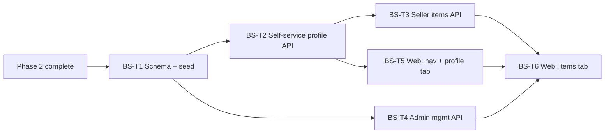

# PatrolKit — Business Seller Feature Plan (Phase 3)

> **Status:** Draft v1 — living document. Consumed by an implementing LLM one task at a time.
> Prerequisite: Phase 2 ski swap implementation is complete (schema, Square config, swap CRUD,
> items CRUD, seller CRUD, seller–item assignment).

---

## 1. Overview & Goals

The **Business Seller** feature allows external vendors to be invited into one or more organizations
as first-class authenticated users. Each business seller manages only their own consignment items via
a dedicated section of the PatrolKit web app.

A business seller is a standard PatrolKit `User` (magic-link auth, same `Membership` model) holding
the new `business_seller` permission. Their `SwapSeller` record is created at invitation time with
`userId` set immediately.

### In scope
- Invite a business seller to an org via the existing member invitation flow.
- Enable / disable a business seller for a given org (new admin endpoint).
- Create a `SwapSeller` record at invitation time, with `userId` set immediately.
- Self-service API: seller profile (read/update), active-swap list, own-item CRUD with photo upload.
- Admin API: list and toggle business sellers within the ski swap admin UI.
- Web: **Business Seller** nav section (Items tab + swap selector + profile tab).

### Explicitly out of scope
- Separate authentication mechanism — business sellers use the same magic-link flow as all users.
- Automatic seller notification emails (invitations use the existing onboarding magic-link email).
- Bulk import of business sellers (use the existing bulk CSV member import if needed).
- Any changes to the manager-facing ski swap UI or existing `ski_swap:*` permission endpoints.

---

## 2. Relationship to Phase 2

This phase adds new surface on top of Phase 2 without modifying any existing endpoint or model
(except the one schema field addition below).

| Phase 2 component | How Phase 3 uses it |
|---|---|
| `SwapSeller` model | Extended with `userId` link; record created at invite time with `userId` set immediately |
| `SwapItem` model | Business sellers create items through a new scoped endpoint; same SKU pipeline |
| `SwapItemPhoto` model | Photo upload reuses the same service; new endpoint scoped to seller |
| `SkiSwap` model | Swap selector reads active swaps via new `/seller/me/swaps` endpoint |
| `inviteMember` service | Called internally by the new `POST /business-sellers` endpoint; unchanged |

---

## 3. Data Model Changes

### 3.1 `SwapSeller` additions

Add one new optional field and a composite unique constraint. All existing fields and relations are
unchanged.

```prisma
model SwapSeller {
  id        String   @id @default(cuid())
  orgId     String
  userId    String?  // PatrolKit User.id; null for anonymous (walk-in) sellers
  type      String   @default("individual") // "individual" | "business"
  name      String
  phone     String
  email     String?
  street    String?
  city      String?
  state     String?
  zip       String?

  payoutMethod               String?   @default("CHECK")
  payoutIdentifierType       String?
  payoutIdentifier           String?
  payoutIdentifierConfirmedAt DateTime?
  createdAt DateTime @default(now())
  updatedAt DateTime @updatedAt

  org       Organization @relation(fields: [orgId], references: [id], onDelete: Cascade)
  user      User?        @relation(fields: [userId], references: [id], onDelete: SetNull)
  swapItems SwapItem[]

  @@unique([orgId, userId])  // one SwapSeller record per user per org
  @@index([orgId, phone])
  @@index([userId])
}
```

### 3.2 `User` model addition

Add the reverse relation (no migration required — Prisma generates it from the `SwapSeller` side):

```prisma
model User {
  // ... existing fields ...
  swapSellers SwapSeller[]
}
```

### 3.3 `Organization` model

No change — the `swapSellers SwapSeller[]` relation already exists.

---

## 4. Permission Catalog Addition

Add one new key to `apps/api/src/contracts/org.contracts.ts` (`PermissionKeySchema`) and to the
seed in `apps/api/prisma/seed.ts`.

| Key | Description |
|---|---|
| `business_seller` | Grants access to the Business Seller section; allows self-service item management for the seller's own items only. Does not imply any `ski_swap:*` permission. |

The org owner seed row does **not** receive `business_seller` automatically. It is granted only
during the explicit invitation flow.

---

## 5. Invitation & Lifecycle

### 5.1 Invitation

Invitations are initiated from the **Sellers tab within the Ski Swap admin UI** — not from the
general Members page. When the `ski_swap:admin` selects the `business` seller type filter, an
**Invite Business Seller** button appears; the resulting form collects name and email and calls
the new `POST /orgs/:orgId/ski-swap/business-sellers` endpoint (see §6.4). That handler executes
the following steps atomically:

1. Creates or finds the `User` by email.
2. Creates an active `Membership` with `business_seller` permission (via `inviteMember`).
3. Sends the standard magic-link onboarding email (fire-and-forget).
4. Checks for an existing anonymous `SwapSeller` by `{ orgId, email }` where `userId IS NULL`.
   - If found, claims it: sets `type = 'business'` and `userId = user.id`.
   - If not found, creates `{ orgId, userId: user.id, type: 'business', name, email, phone: '' }`.

`inviteMember` always creates the `User` record if none exists, so `userId` is available
by step 4 and is never null on the resulting `SwapSeller` row.

A business seller can be invited to multiple orgs independently; each invitation produces a
separate `Membership` row and a separate `SwapSeller` row.

### 5.2 Enable / Disable

A `ski_swap:admin` toggles a business seller's access via a new dedicated endpoint
(`PATCH /orgs/:orgId/ski-swap/business-sellers/:userId/status`). This endpoint:

- Requires `ski_swap:admin` permission.
- Resolves the target `Membership` by `{ orgId, userId }`.
- Verifies the membership holds `business_seller` before modifying it — returns 404 otherwise
  (prevents a `ski_swap:admin` from toggling arbitrary org members).
- Sets `Membership.status = 'active' | 'disabled'`.
- Writes to `AuditLog` with `action: 'business_seller.status_changed'`.

When disabled, the membership guard rejects subsequent requests from that user within the org.
Their `SwapItem` records and Square catalog entries are unaffected — managers still see them.

### 5.3 Multi-org participation

Because `SwapSeller` has `@@unique([orgId, userId])` rather than `@unique` on `userId` alone,
a single user may hold separate `SwapSeller` records (and separate `Membership` rows) across
multiple orgs. The existing org-context selector (org switcher) in the web app handles choosing
the active org — no new mechanism is required.

---

## 6. API Surface

Base path: `/api/v1`. Standard `{ success, data }` / `{ success, error, code }` envelope applies.

All endpoints below require `JwtAuthGuard`, `OrgContextGuard`, and `ModuleEnabledGuard('ski_swap')`.

### 6.1 Self-service profile

| Method | Path | Permission | Notes |
|---|---|---|---|
| `GET` | `/orgs/:orgId/ski-swap/seller/me` | `business_seller` | Return own `SwapSeller` profile. |
| `PATCH` | `/orgs/:orgId/ski-swap/seller/me` | `business_seller` | Update name, phone, email, street, city, state, zip, payout fields. Unknown fields rejected. |

### 6.2 Active swap list (for swap selector)

| Method | Path | Permission | Notes |
|---|---|---|---|
| `GET` | `/orgs/:orgId/ski-swap/seller/me/swaps` | `business_seller` | Returns all active swaps for the org: `{ id, title }`. Read-only; no additional Square calls. |

### 6.3 Self-service items

| Method | Path | Permission | Notes |
|---|---|---|---|
| `GET` | `/orgs/:orgId/ski-swap/seller/me/items` | `business_seller` | List own items. Supports `?swapId=` filter; without it, returns items across all active swaps. |
| `POST` | `/orgs/:orgId/ski-swap/seller/me/items` | `business_seller` | Create item. `swapId` required in body. `sellerId` injected server-side; not accepted from client. |
| `GET` | `/orgs/:orgId/ski-swap/seller/me/items/:itemId` | `business_seller` | Single item detail + photos. 403 if `item.sellerId ≠ callerSellerId`. |
| `PATCH` | `/orgs/:orgId/ski-swap/seller/me/items/:itemId` | `business_seller` | Update name, description, price, quantity. 403 if not owner. |
| `DELETE` | `/orgs/:orgId/ski-swap/seller/me/items/:itemId` | `business_seller` | Delete item. 403 if not owner. |
| `POST` | `/orgs/:orgId/ski-swap/seller/me/items/:itemId/photos` | `business_seller` | Upload photo (`multipart/form-data`, field `image`). 403 if not owner. |
| `DELETE` | `/orgs/:orgId/ski-swap/seller/me/items/:itemId/photos/:photoId` | `business_seller` | Delete photo. 403 if not owner. |

### 6.4 Admin business seller management

| Method | Path | Permission | Notes |
|---|---|---|---|
| `POST` | `/orgs/:orgId/ski-swap/business-sellers` | `ski_swap:admin` | Invite a business seller: create `Membership` + `SwapSeller` atomically (see §5.1). Body: `{ name, email }`. |
| `GET` | `/orgs/:orgId/ski-swap/business-sellers` | `ski_swap:admin` | List members with `business_seller` permission; includes `status`, `joinedAt`, and linked `SwapSeller` profile. |
| `PATCH` | `/orgs/:orgId/ski-swap/business-sellers/:userId/status` | `ski_swap:admin` | Toggle membership `status`. Only operates on `business_seller` memberships (404 otherwise). Writes to `AuditLog`. |

---

## 7. Implementation Details

### 7.1 Ownership enforcement

`SellerSelfService` exposes a `requireOwnership(itemId: string, callerSellerId: string): Promise<SwapItem>` helper that:

1. Loads `SwapItem` by `{ id: itemId, orgId }` — 404 if not found.
2. Throws `ForbiddenException` if `item.sellerId !== callerSellerId`.

All mutating item endpoints call this helper before any write operation.

### 7.2 Item creation by business seller

The `POST /seller/me/items` handler:

1. Resolves the caller's `SwapSeller` record via `SellerSelfService` (lookup by `{ orgId, userId }`).
2. Loads the target `SkiSwap` by `{ id: swapId, orgId, active: true }` — 404 if inactive or not found.
3. Delegates to the **existing** `SwapItemsService.createItem(...)`, injecting `sellerId` from step 1.
4. SKU generation (`skuPrefix` + atomic `skuCounter` increment), Square catalog sync (if configured),
   and `SwapItemPhoto` handling are all unchanged — reused from Phase 2.

The `sellerId` field is removed from the request schema (`SellerItemCreateRequest`) so clients
cannot supply it. The service populates it internally.

### 7.3 Quantity updates and Square sync

`PATCH /seller/me/items/:itemId` follows the same Square sync rules as the manager `PATCH`
endpoint: quantity changes use `PHYSICAL_COUNT`, catalog field changes fetch the current `version`
first (optimistic locking). Business sellers may change quantity on their own items.

### 7.4 Swap selector state

The web app persists the selected `swapId` for the business seller view in `localStorage` under key:
```
patrolkit:{userId}:{orgId}:sellerSelectedSwap
```
This is a separate key from the manager's `patrolkit:{userId}:{orgId}:selectedSwap` to avoid
collision if a user holds both `business_seller` and `ski_swap:report`.

On first visit (no stored value), default to the first active swap returned by
`GET /seller/me/swaps`.

### 7.5 Nav visibility

The **Business Seller** nav item appears in the app shell when **both** conditions are true:
1. `ski_swap` is enabled for the current org (`OrgModule.enabled = true`).
2. The current user's `permissions[]` (from `GET /me`) includes `business_seller`.

It appears alongside, not instead of, any `ski_swap:report`-gated nav items. A user holding both
`business_seller` and `ski_swap:report` sees both sections.

### 7.6 Admin UI placement

Business sellers are managed on the **existing Sellers page** (`/app/ski-swap/sellers`), using the
existing seller type selector. When `Business` is active and the current user holds `ski_swap:admin`,
an **Invite Business Seller** button appears above the table. Each business-type row also exposes
an enable/disable action (calls `PATCH /business-sellers/:userId/status`). Individual seller rows
are unaffected and show no membership controls.

---

## 8. Contracts

Add the following Zod schemas to `apps/api/src/contracts/ski-swap.contracts.ts`:

| Schema | Used by |
|---|---|
| `InviteBusinessSellerRequest` | `POST /business-sellers` body (`{ name, email }`) |
| `SellerProfileResponse` | `GET/PATCH /seller/me` response |
| `UpdateSellerProfileRequest` | `PATCH /seller/me` body |
| `SellerSwapSummary` | Entry in `GET /seller/me/swaps` response (`{ id, title }`) |
| `SellerItemCreateRequest` | `POST /seller/me/items` body (no `sellerId` field) |
| `SellerItemUpdateRequest` | `PATCH /seller/me/items/:itemId` body |
| `BusinessSellerMemberResponse` | Entry in `GET /business-sellers` response |
| `UpdateBusinessSellerStatusRequest` | `PATCH /business-sellers/:userId/status` body (`{ status }`) |

All schemas use strict mode (`.strict()`) to reject unknown fields.

---

## 9. Security Considerations

- **Ownership gate**: every `/seller/me/items/:itemId` mutation calls `requireOwnership` before
  any write. `sellerId` on create is injected server-side and never accepted from the client.
- **Scope isolation**: `business_seller` does not grant any `ski_swap:*` permission. Requests to
  `ski_swap:report/manage/admin`-gated endpoints return 403 for members holding only
  `business_seller`.
- **Enable/disable scoping**: `PATCH /business-sellers/:userId/status` verifies the target holds
  `business_seller` before modifying the membership, preventing a `ski_swap:admin` from
  inadvertently toggling unrelated org members.
- **Cross-org isolation**: `OrgContextGuard` filters all DB queries by `orgId`. A business seller
  active in org A cannot read or write any data belonging to org B.
- **Audit trail**: all status toggles by an admin write to `AuditLog`.
- **Module guard**: all endpoints (including `/seller/me/*`) require the `ski_swap` module to be
  enabled for the org. A business seller whose org disables the module receives a module-disabled
  error, not a permission error.

---

## 10. Testing Strategy

### Unit
- `SellerSelfService.getSellerRecord`: returns record for `{ orgId, userId }`; 404 if not found.
- Invitation flow: `SwapSeller` created with correct fields when invitee has no existing account; `userId` set immediately when invitee already has an account; existing anonymous record claimed when email matches.
- `requireOwnership`: matching `sellerId` passes; mismatched throws `ForbiddenException`.
- `UpdateBusinessSellerStatusRequest` validation: only `active`/`disabled` accepted.

### Integration (Testcontainers + mock Square client)
- **Invite**: invite by email; verify `SwapSeller` created with `userId` set and `type = 'business'`; membership active; magic-link email sent.
- **Email claim**: create anonymous `SwapSeller` with email; invite same email as business seller;
  call `GET /seller/me`; verify `userId` linked on existing record.
- **Full item lifecycle**: create item; verify `sellerId` set to caller; update; delete.
- **Ownership enforcement**: user A cannot `PATCH`/`DELETE` user B's item (403).
- **Swap selector**: only active swaps returned; inactive swap absent.
- **Admin list**: correct members returned; non-`business_seller` members excluded.
- **Admin status toggle**: `active → disabled` blocks subsequent seller requests; 404 when
  targeting a non-`business_seller` member.
- **Multi-org**: same user invited to org A and org B; separate `SwapSeller` records created;
  data isolated.

### Web (component tests)
- Swap selector renders and stores selection in `localStorage`.
- Items tab filters by selected swap.
- Add/edit drawer injects correct `swapId`; does not send `sellerId`.
- Business Seller nav item hidden when `business_seller` permission absent.

---

## 11. Execution DAG & Task Breakdown



### Ordered task list

| # | Task | Depends on |
|---|---|---|
| BS-T1 | Schema: add `userId` + `@@unique([orgId, userId])` + `@@index([userId])` to `SwapSeller`; add `swapSellers` relation to `User`; migration; seed `business_seller` permission key | Phase 2 complete |
| BS-T2 | `SellerSelfService` (`getSellerRecord`, `requireOwnership`); contracts; `GET/PATCH /seller/me`; `GET /seller/me/swaps` | BS-T1 |
| BS-T3 | Business seller items API: full CRUD + photos under `/seller/me/items` | BS-T2 |
| BS-T4 | Admin business seller management API: `POST /business-sellers`, `GET /business-sellers`, `PATCH /business-sellers/:userId/status` | BS-T1 |
| BS-T5 | Web: Business Seller nav item (visibility gating); profile tab (`/app/ski-swap/seller/profile`) | BS-T2, SS-P6-T1 |
| BS-T6 | Web: invite form + enable/disable actions on Sellers page (business type); Business Seller items tab — swap selector, item list, add/edit/delete drawer, photo upload/delete | BS-T3, BS-T4, BS-T5 |
