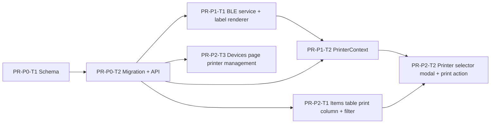

# PatrolKit — Web Bluetooth Price Tag Printing (Phase 4)

> **Status:** Draft v1 — living document. Consumed by an implementing LLM one task at a time.
> Prerequisite: Phase 2 (Ski Swap) and Phase 3 (Business Seller) are complete.

---

## 1. Overview & Goals

Phase 4 adds **WebBluetooth-based price tag printing** to the Ski Swap item list. Managers
and business sellers can print Code128 + price labels to a **Phomemo M110** thermal printer
directly from the browser without any driver or middleware.

A ski swap admin provisions and assigns physical printers via the existing Devices page.
Organizational users print to unassigned (org-pool) printers; business sellers print only
to their assigned printer.

### In scope
- `hasPrintedTag` boolean on `SwapItem`, set automatically on successful print.
- Print status column and filter in the items table (FontAwesome icons).
- Per-item "Print" / "Reprint" action button.
- Printer management section on the Devices page: provision, name, assign to seller, delete.
- Printer selector modal when multiple printers are online; last-used printer persisted in
  localStorage.
- TypeScript port of the Swift BLE driver and Code128/label renderer using WebBluetooth +
  Canvas API.
- Unsupported-browser warning (WebBluetooth requires Chrome or Edge).

### Explicitly out of scope
- Any native iOS printing path (separate concern for the iOS app).
- Printer firmware updates or Square integration.
- Email / SMS print confirmations.
- Support for any printer model other than Phomemo M110.

---

## 2. Reference Implementation

The `printer_prototype/` folder contains a working Swift implementation. The key primitives
that must be ported to TypeScript are:

| Swift component | TypeScript equivalent |
|---|---|
| `code128BModules(_:)` in `main.swift` | `code128BModules(text: string): boolean[]` |
| `generateSkiSwapLabel(sku:price:description:)` | `generateLabel(item): boolean[][]` via Canvas API |
| `PrintCommands` | `PrintCommands` constant object (same byte values) |
| `ConnectedPrinter._sendPrintJob(rows:)` | `PhomemoPrinter.print(rows)` via WebBluetooth |
| `ConnectedPrinter.flushQueue()` + ACK wait | Promise-based chunk writer with notify listener |
| `PrinterKit` | `PrinterContext` React context |

### BLE constants (from `PhomemoUUIDs.swift`)

```ts
const PHOMEMO_SERVICE = '0000ff00-0000-1000-8000-00805f9b34fb';
const WRITE_CHAR      = '0000ff02-0000-1000-8000-00805f9b34fb';
const ACK_CHAR        = '0000ff03-0000-1000-8000-00805f9b34fb'; // per-chunk ACK notifications
```

### Print job protocol

1. Build command stream: `initialize()` + `setPrintEnergy(2)` + `setPrintSpeed(3)` +
   `printRasterImage(rows)` + `feed(30 dots)`.
2. Split into **182-byte chunks** (calibrated in `ConnectedPrinter`).
3. Write each chunk via `characteristic.writeValueWithoutResponse(chunk)`.
4. After each chunk, wait for a notification on `ACK_CHAR` with payload `[0x01, 0x01]` before
   sending the next chunk.
5. Resolve the print promise only after the final ACK.

### Label layout (304 × 224 content dots, 8 dots/mm → ~38 × 28 mm)

Adapted from `generateSkiSwapLabel` in `main.swift`:

```
Rows   8–72   : Code128B barcode encoding the SKU (2 dots per module)
Row   87      : SKU text (16pt, centred)
Row  112      : Horizontal separator line (cols 16–287)
Rows 113–224  : Bottom half
  Baseline 173: Price in dollars, bold 44pt, centred  (e.g. "$24.99")
  Baseline 200: Item name, 15pt, centred
```

The Canvas API replaces `CTFontCreateWithName` / `CTLineDraw`. Fonts used:
- Bold text: `bold <size>px "Helvetica Neue", Helvetica, Arial, sans-serif`
- Regular text: `<size>px "Helvetica Neue", Helvetica, Arial, sans-serif`

After rendering, read pixel data via `ctx.getImageData()`, convert to grayscale, and
threshold at 128 to produce the `boolean[][]` raster.

---

## 3. Data Model Changes

### 3.1 `SwapItem` addition

```prisma
model SwapItem {
  // … existing fields …
  hasPrintedTag Boolean @default(false)
}
```

`hasPrintedTag` is set to `true` by the frontend after a confirmed successful print and
written back via the existing `PATCH .../items/:itemId` endpoint (see §4.1). It is never
set manually — no admin toggle is exposed.

### 3.2 New `SwapPrinter` model

```prisma
// Registered Phomemo M110 Bluetooth printers per org
model SwapPrinter {
  id               String   @id @default(cuid())
  orgId            String
  name             String                    // Admin-given friendly alias, e.g. "Printer A"
  bluetoothName    String                    // BLE advertised local name for device matching
  assignedSellerId String?                   // null = org-pool; set = business-seller only
  createdBy        String?
  createdAt        DateTime @default(now())
  updatedAt        DateTime @updatedAt

  org    Organization @relation(fields: [orgId], references: [id], onDelete: Cascade)
  seller SwapSeller?  @relation(fields: [assignedSellerId], references: [id], onDelete: SetNull)

  @@index([orgId])
  @@index([assignedSellerId])
}
```

Add relations to existing models:

```prisma
// On Organization:
swapPrinters  SwapPrinter[]

// On SwapSeller:
assignedPrinters SwapPrinter[]
```

---

## 4. API Surface

All new endpoints live under `/api/v1/orgs/:orgId/ski-swap/` and are guarded by
`JwtAuthGuard`, `OrgContextGuard`, `ModuleEnabledGuard('ski_swap')`, and `PermissionsGuard`.

### 4.1 Existing endpoint — `hasPrintedTag`

The existing `PATCH /orgs/:orgId/ski-swap/swaps/:swapId/items/:itemId` already handles
partial updates; **add `hasPrintedTag?: boolean` to its Zod request schema** and to the
response contract. Permission: `ski_swap:manage` for org users; business-seller endpoint
`PATCH /orgs/:orgId/ski-swap/seller/items/:itemId` likewise.

### 4.2 Printer management endpoints

| Method | Path | Permission | Notes |
|---|---|---|---|
| GET | `/orgs/:orgId/ski-swap/printers` | `ski_swap:manage` | List all printers. Business sellers receive only their assigned printer (filtered by `assignedSellerId = seller.id`). |
| POST | `/orgs/:orgId/ski-swap/printers` | `ski_swap:admin` | Provision a printer. Body: `{ name, bluetoothName }`. |
| PATCH | `/orgs/:orgId/ski-swap/printers/:printerId` | `ski_swap:admin` | Update `name`, `bluetoothName`, or `assignedSellerId`. |
| DELETE | `/orgs/:orgId/ski-swap/printers/:printerId` | `ski_swap:admin` | Remove printer record. |

#### `GET /printers` response shape

```json
[
  {
    "id": "cuid",
    "name": "Printer A",
    "bluetoothName": "M110-XXXX",
    "assignedSellerId": null,
    "assignedSellerName": null
  }
]
```

#### `POST /printers` request

```json
{ "name": "Printer A", "bluetoothName": "M110-XXXX" }
```

`bluetoothName` is captured by the admin's browser during the registration scan (see §6.4).

---

## 5. Permission Scope — Printer Visibility Rules

These rules are enforced in both the API (`GET /printers`) and in the frontend
`PrinterContext`:

| User type | Sees |
|---|---|
| Org user (`ski_swap:manage`) | Printers where `assignedSellerId IS NULL` |
| Business seller (`business_seller`) | Printers where `assignedSellerId = their SwapSeller.id` |
| Ski swap admin (`ski_swap:admin`) | All printers (for management) |

---

## 6. Frontend Architecture

### 6.1 `PhomemoPrinterService.ts`

`apps/web/src/lib/printing/PhomemoPrinterService.ts`

Pure-logic service; no React dependency.

```ts
export interface ConnectedM110 {
  device: BluetoothDevice;
  print(rows: boolean[][]): Promise<void>;
  disconnect(): void;
}

export async function connectPrinter(bluetoothName: string): Promise<ConnectedM110>
```

- **`code128BModules(text: string): boolean[]`** — direct port of the Swift encoder. Same
  pattern table, same checksum algorithm.
- **`generateLabel(item: { name, priceCents, sku }): boolean[][]`** — renders to an
  offscreen `HTMLCanvasElement` (304 × 224 px), then reads back pixel data and thresholds.
  Reproduces the layout from §2 (barcode top half, price + name bottom half).
- **`buildPrintJob(rows: boolean[][]): Uint8Array`** — assembles the ESC/POS byte stream
  (`initialize`, `setPrintEnergy`, `setPrintSpeed`, `printRasterImage`, `feed`).
- **`sendJob(writeChar, ackChar, job): Promise<void>`** — chunks at 182 bytes, writes each
  chunk via `writeValueWithoutResponse`, awaits the `[0x01, 0x01]` notification on `ackChar`
  before sending the next.

`connectPrinter` flow:
1. Call `navigator.bluetooth.requestDevice({ filters: [{ name: bluetoothName }], optionalServices: [PHOMEMO_SERVICE] })`.
2. `device.gatt.connect()`.
3. `getPrimaryService(PHOMEMO_SERVICE)`.
4. `getCharacteristic(WRITE_CHAR)` and `getCharacteristic(ACK_CHAR)`.
5. `ackChar.startNotifications()`.
6. Return `ConnectedM110` wrapper.

**Browser support guard:** export `isWebBluetoothSupported(): boolean` that checks
`'bluetooth' in navigator`. Components consume this to gate the print UI.

### 6.2 `PrinterContext.tsx`

`apps/web/src/contexts/PrinterContext.tsx`

```ts
interface PrinterContextValue {
  // Registered printers from the API (filtered by user type)
  printers: SwapPrinterRecord[];
  // BLE connections keyed by SwapPrinter.id
  connections: Map<string, ConnectedM110>;
  // Connect to a printer by its registered SwapPrinter record
  connectPrinter(printer: SwapPrinterRecord): Promise<void>;
  // Disconnect a printer
  disconnectPrinter(printerId: string): void;
  // Last-used printer ID (localStorage)
  lastUsedPrinterId: string | null;
  setLastUsedPrinterId(id: string): void;
  // Print an item — resolves after successful print
  printItem(item: ItemResponse, printerId: string): Promise<void>;
}
```

localStorage key: `patrolkit:{userId}:{orgId}:lastPrinterId`

On mount, `PrinterContext` attempts to reconnect to the last-used printer using
`navigator.bluetooth.getDevices()` (if the browser supports it) and filters by
`bluetoothName` from the registered printer record.

### 6.3 `PrinterSelectorModal.tsx`

`apps/web/src/components/PrinterSelectorModal.tsx`

Shown when the user clicks "Print" on an item and either no printer is connected, or multiple printers are connected and the last-used one is unavailable.

1. List available printers (filtered by user type from `PrinterContext.printers`).
2. For each printer: show name + status chip (`Online` / `Connecting…` / `Offline`).
3. A **"Connect"** button per offline printer (triggers `connectPrinter()`; must be
   user-initiated for browser BLE permission).
4. After the user selects an online printer and confirms, call `printItem()`.
5. If exactly one printer is online (and it is the last-used), skip the modal.
6. If no printers are registered at all, show "No printers configured — ask your admin to
   provision a printer on the Devices page."

### 6.4 Devices Page — Printer Management Section

New section appended below the existing device list in `DevicesPage.tsx`, visible to users
with `ski_swap:admin`.

**Printer list table** — columns: Name, Bluetooth Name, Assigned Seller, Actions
(Edit / Delete).

**Provision printer form**:
1. Admin types a friendly name.
2. Admin clicks **"Scan for Printer"** — triggers `navigator.bluetooth.requestDevice()`
   with a filter for `PHOMEMO_SERVICE`. The browser's native device picker appears.
3. On selection, the device's `name` property is captured and pre-filled as `bluetoothName`.
4. Admin confirms → `POST /printers`.

**Assign to seller**: inline select (populated from seller list); `PATCH /printers/:id` on
change. `null` = org pool.

### 6.5 `SwapItemsPanel.tsx` changes

1. **`ItemResponse` type** — add `hasPrintedTag: boolean` (updated in `api.types.ts`).

2. **Print status column** — between "Sold" and "Actions":
   - Not printed: `<i className="fa-duotone fa-tag text-amber-400" title="Not printed" />`
   - Printed: `<i className="fa-duotone fa-tag text-green-500" title="Printed" />`

3. **Print status filter** — add a third filter control to the toolbar:
   ```
   <select>
     <option value="">All</option>
     <option value="not_printed">Not printed</option>
     <option value="printed">Printed</option>
   </select>
   ```
   Filtering is client-side (applied to `data.items` before rendering).

4. **Print action button** — in the actions cell:
   - If `!hasPrintedTag`: `<button>Print tag</button>` (primary style).
   - If `hasPrintedTag`: `<button>Reprint</button>` (secondary/ghost style).
   - Both call `handlePrint(item)` which:
     1. Checks `isWebBluetoothSupported()` — if false, opens the
        unsupported-browser warning modal.
     2. Determines which online printer to use (last-used first, else opens
        `PrinterSelectorModal`).
     3. Calls `printItem(item, printerId)`.
     4. On success: calls `panelApi.patchItem(item.id, { hasPrintedTag: true })` and
        invalidates the query.

5. **Unsupported-browser modal** — simple dialog: "Printing requires Chrome or Edge.
   Firefox and Safari do not support WebBluetooth."

---

## 7. Font Awesome

The project uses Font Awesome Pro. Confirm the kit script or `@fortawesome/fontawesome-pro`
package is wired up in `apps/web` before implementing. Pro tiers available: `fa-solid`,
`fa-regular`, `fa-light`, `fa-thin`, `fa-duotone`. Use whichever variant best fits the
existing app's visual style — suggestions below are a starting point, not prescriptive.

| Icon | Suggested class | Usage |
|---|---|---|
| Tag (unprinted) | `fa-duotone fa-tag` (amber) | Item not yet printed |
| Tag (printed) | `fa-duotone fa-tag` (green) | Item printed |
| Print | `fa-duotone fa-print` | Print action button |
| Reprint | `fa-duotone fa-rotate-right` | Reprint action button |
| Print unavailable | `fa-duotone fa-print-slash` | Print disabled (unsupported browser, no printer) |
| Bluetooth | `fa-duotone fa-bluetooth` | Printer connect button |
| Printer offline | `fa-duotone fa-circle-xmark` | Offline status chip |
| Printer online | `fa-duotone fa-circle-check` | Online status chip |

---

## 8. Security Considerations

- **No server involvement in printing.** The BLE connection is entirely browser-side; no
  print data passes through the PatrolKit API. The only API calls are:
  - `GET /printers` (list registered printers for the org/seller).
  - `PATCH .../items/:id` with `{ hasPrintedTag: true }` after a successful print.
- **Printer isolation.** The `GET /printers` endpoint enforces org isolation (via
  `OrgContextGuard`) and the seller-assignment rule server-side. A business seller cannot
  discover org-pool printers through the API.
- **No sensitive data on label.** The printed label contains only SKU, price, and item
  name — no seller PII, no auth tokens.
- **`hasPrintedTag` permission.** Setting `hasPrintedTag` reuses the existing
  `ski_swap:manage` / `business_seller` guards already on the item PATCH endpoint.

---

## 9. Testing Strategy

- **Unit:**
  - `code128BModules` — known SKU strings produce correct module counts and checksums.
  - `buildPrintJob` — output starts with ESC `@`, includes `GS v 0` raster header.
  - Printer visibility filter logic (org user vs. business seller).
- **Integration:**
  - `POST /printers` → appears in `GET /printers`; org user cannot see seller-assigned printers.
  - `PATCH /printers/:id` assignment → seller sees printer; org user no longer sees it.
  - `PATCH .../items/:id { hasPrintedTag: true }` requires `ski_swap:manage`; returns 403 for
    users with only `ski_swap:report`.
- **Web component tests:**
  - `SwapItemsPanel` renders print status icons; filter correctly hides/shows rows.
  - `PrinterSelectorModal` skips display when exactly one online last-used printer exists.
  - Unsupported-browser modal fires when `isWebBluetoothSupported()` returns `false`.
- **Manual BLE test:** use the reference `printer_prototype` Swift binary to verify the
  TypeScript-generated byte stream produces identical output for the same input.

---

## 10. Execution DAG & Task Breakdown



### Ordered task list

| # | Task | Depends on |
|---|---|---|
| PR-P0-T1 | Schema: `hasPrintedTag` on `SwapItem`; new `SwapPrinter` model + relations | — |
| PR-P0-T2 | Migration; contracts (`hasPrintedTag` in item schemas, new printer contracts); printer CRUD API | PR-P0-T1 |
| PR-P1-T1 | `PhomemoPrinterService.ts`: Code128 encoder, Canvas label renderer, BLE driver, `isWebBluetoothSupported` | PR-P0-T2 |
| PR-P1-T2 | `PrinterContext.tsx` + `usePrinter` hook; last-used localStorage; reconnect via `getDevices()` | PR-P1-T1, PR-P0-T2 |
| PR-P2-T1 | `SwapItemsPanel`: print-status column (FA icons), print-status filter, `hasPrintedTag` in `ItemResponse` type | PR-P0-T2 |
| PR-P2-T2 | `PrinterSelectorModal`; print/reprint action buttons in `SwapItemsPanel`; unsupported-browser modal | PR-P1-T2, PR-P2-T1 |
| PR-P2-T3 | Devices page: printer management section (provision via BLE scan, list, assign to seller, delete) | PR-P0-T2 |

**Parallelism notes:**
- After **PR-P0-T2**, tasks **PR-P1-T1**, **PR-P2-T1**, and **PR-P2-T3** are independent
  and can proceed in parallel.
- **PR-P1-T2** requires **PR-P1-T1** (needs `ConnectedM110` type) and **PR-P0-T2** (needs
  `SwapPrinterRecord` type from contracts).
- **PR-P2-T2** is the integration task; it requires both UI primitives and the context.

---

## Appendix A — ESC/POS Command Reference

Port of `PrintCommands.swift` to TypeScript constants:

```ts
const HEAD_WIDTH_DOTS    = 320;
const HEAD_WIDTH_BYTES   = 40;
const LEFT_OFFSET_DOTS   = 16;
const CONTENT_WIDTH_DOTS = 304;
const PRINT_HEIGHT_DOTS  = 240;
const TOP_MARGIN_ROWS    = 8;
const BOTTOM_MARGIN_ROWS = 8;
const CONTENT_HEIGHT_DOTS = 224;

function initialize(): Uint8Array  { return new Uint8Array([0x1B, 0x40]); }
function setPrintEnergy(level = 2) { return new Uint8Array([0x1F, 0x11, 0x08, Math.min(level, 2)]); }
function setPrintSpeed(level = 3)  { return new Uint8Array([0x1F, 0x11, 0x07, level]); }
function feed(dots = 30)           { return new Uint8Array([0x1B, 0x4A, dots]); }
```

`printRasterImage(rows: boolean[][]): Uint8Array` follows the same logic as the Swift
version: prepend top-margin blank rows, place each content row at `leftOffsetDots` within
the 40-byte head row, append bottom-margin blank rows.

---

## Appendix B — WebBluetooth API Surface Used

```ts
// Request device (must be triggered by user gesture)
const device = await navigator.bluetooth.requestDevice({
  filters: [{ name: bluetoothName }],
  optionalServices: [PHOMEMO_SERVICE],
});

// Reconnect to previously permitted device (no gesture required)
const devices = await navigator.bluetooth.getDevices(); // may not be available in all browsers

// Connect
const server = await device.gatt!.connect();
const service = await server.getPrimaryService(PHOMEMO_SERVICE);
const writeChar = await service.getCharacteristic(WRITE_CHAR);
const ackChar   = await service.getCharacteristic(ACK_CHAR);

// Subscribe to ACK notifications
await ackChar.startNotifications();
ackChar.addEventListener('characteristicvaluechanged', handler);

// Write a chunk (no response expected from printer for the write itself)
await writeChar.writeValueWithoutResponse(chunk);
```

`navigator.bluetooth.getDevices()` is in the WebBluetooth spec but flagged as experimental
in some browsers. Guard its use with `'getDevices' in navigator.bluetooth`.
